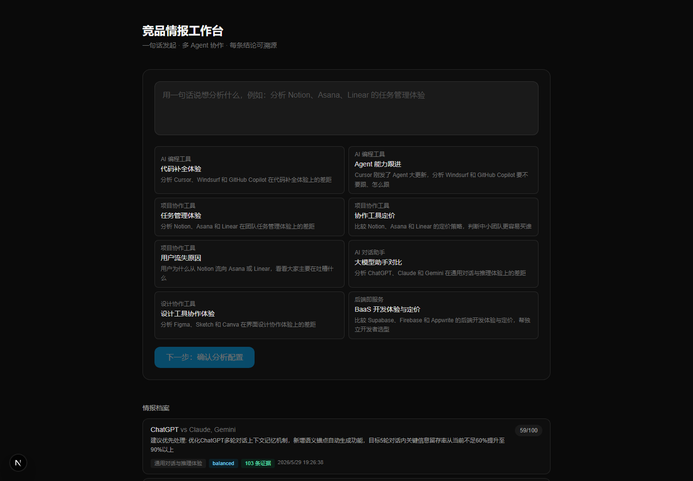
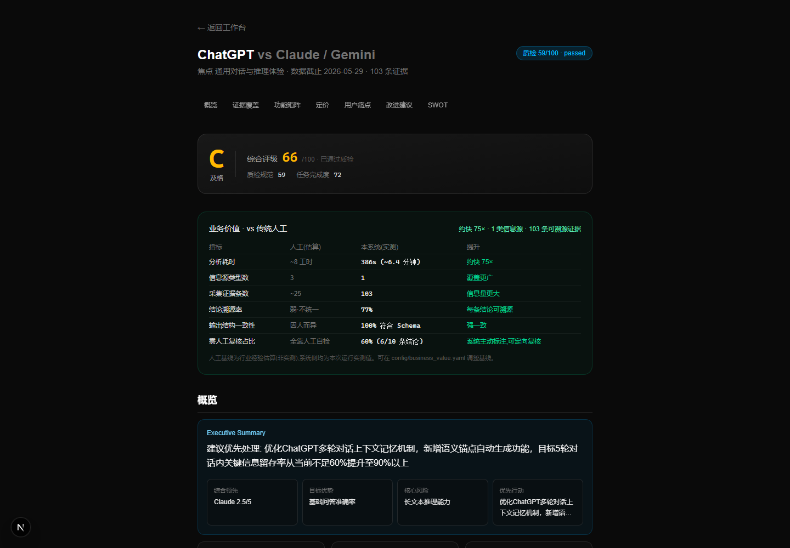
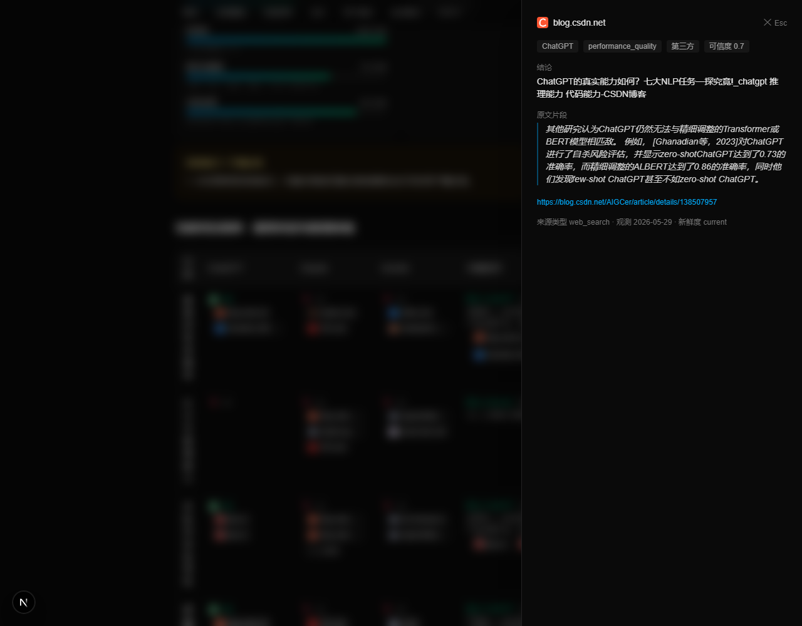
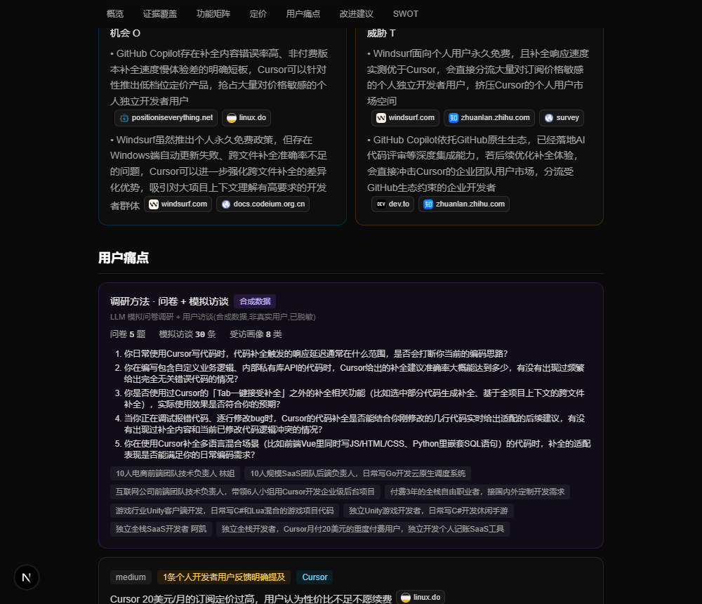
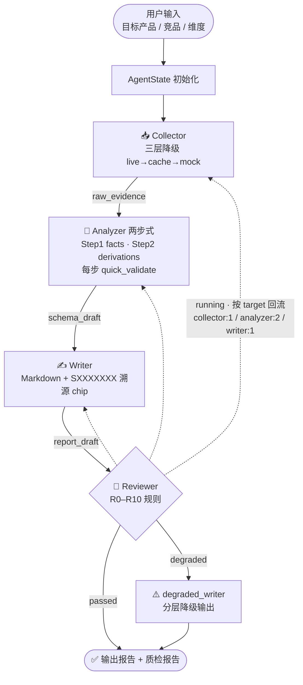
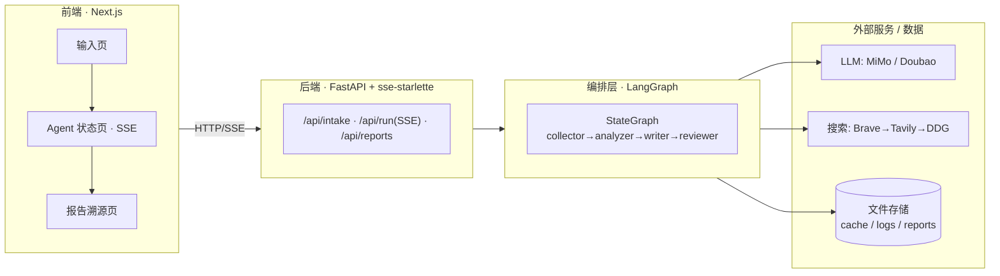

# 🛰️ AI Competitive Radar · 竞品分析 Agent 协作系统

> 字节跳动 AI 全栈挑战赛 · Topic 3
> 多 Agent 协作 · LangGraph 编排 · 结论级证据溯源 · 设计 v2.2.1

**输入一句话「分析 X 和 Y 在 Z 维度的差距」→ 自动产出结构化竞品报告**：功能对比矩阵 / 用户痛点 / 定价策略 / SWOT / 优先级建议——**每一条结论都可一键溯源到原始 evidence**。

<p align="center">
  
</p>

---

## ✨ 核心特性

| 能力 | 说明 |
|------|------|
| 🤝 **四 Agent 流水线协作** | 采集 → 分析（两步式）→ 撰写 → 质检，LangGraph 编排为有向图，单一 `AgentState` 全局共享 |
| 🧬 **结构化 Schema 抽取** | 字段冻结的知识 Schema（功能树 / 定价模型 / 用户画像 / SWOT / 建议），跨产品跨行业输出一致 |
| 🔁 **质检反馈闭环** | Reviewer 跑 R0–R10 规则，不合格按 `reject_target` 精准打回，最多 2 轮，超限分层降级，杜绝死循环 |
| 🔗 **结论级证据溯源** | 每条结论带确定性 hash `evidence_id`，正文以 `[SXXXXXXX]` chip 标注，前端一键跳转原文 |
| 🪂 **三层采集降级** | 抓取 live → cache → mock；搜索 Brave → Tavily → DuckDuckGo；断网 / 无 key 也能跑通闭环 |
| 🧩 **配置驱动跨行业** | 换行业只改 `config/*.yaml` + `prompts/*.md`，**代码零改动** |
| 🔍 **全链路可观测** | LangSmith + `logs/{agent_trace,llm_calls,stage_quality}.jsonl`，每个节点决策可追溯 |

---

## 📸 界面预览

| 报告页 · 质检徽章 + 业务价值量化 | 证据溯源 · 点 chip 看原文 |
|:---:|:---:|
|  |  |
| 综合评级 + 「vs 传统人工」对比表（约快 75×、103 条可溯源证据） | 抽屉展示原文片段、来源 URL、可信度评级 |

| SWOT + 用户痛点 + 调研方法 |
|:---:|
|  |
| SWOT 四象限每条带来源 chip；用户痛点附「问卷 + 模拟访谈」调研方法与受访画像 |

---

## 🏗️ 系统架构

### 数据流（四 Agent + 降级闭环）



### 分层调用关系



详细设计见 [`docs/design-v2.2.md`](docs/design-v2.2.md)（v2.2.1 已冻结，含答辩 / 合规 / 质量评测附录）。

---

## 🚀 快速开始

```powershell
# 1. 创建虚拟环境（Python 3.10+）
python -m venv .venv
.\.venv\Scripts\Activate.ps1

# 2. 安装依赖
pip install -r requirements.txt

# 3a. CLI 跑一次（Mock 模式，无需任何 API key）
$env:ANALYZER_MOCK="1"
python -m src.graph
#   产物：out/ai_coding/{report.md, schema_draft.json, quality_report.json}

# 3b. CLI 跑真实 LLM（默认小米 MiMo）
$env:ANALYZER_MOCK=""
$env:LLM_API_KEY="你的 key"
python -m src.graph
#   切回豆包：额外设 $env:LLM_MODEL="ep-xxx" 和 $env:LLM_BASE_URL="<方舟地址>"

# 3c. 启动前端工作台（推荐演示用）— Next.js + FastAPI
#   终端 1：后端 API
.\.venv\Scripts\python.exe -m uvicorn api.main:app --port 8000
#   终端 2：前端
cd web ; npm install ; npm run dev
#   浏览器打开 http://localhost:3000
```

---

## 🔀 切换行业（零代码）

`config/domains.yaml` 已内置两个域，改一个环境变量即可：

```powershell
$env:DOMAIN="ai_coding"   # Cursor vs Windsurf vs GitHubCopilot
python -m src.graph

$env:DOMAIN="pm"          # Notion vs Asana vs Linear
python -m src.graph
```

新增行业 = 在 `config/domains.yaml` 加一个 entry + 写一份 `data/sample_sources_<domain>.json`，**代码 0 改动**。

---

## 🌐 部署到服务器

后端是标准 FastAPI ASGI 应用，可直接部署：

```bash
# 生产启动（绑 0.0.0.0，去掉 --reload）
uvicorn api.main:app --host 0.0.0.0 --port 8000
```

**部署要点（务必注意）**：

1. **不要上 Serverless**。主流程 `/api/run` 是 SSE 长连接、整轮约 3 分钟（analyzer ~130s），需长驻进程环境（云 VM / Render / Railway / Fly / Docker）。
2. **反向代理关 SSE 缓冲**。Nginx 需 `proxy_buffering off;` + `proxy_read_timeout 300s;`，否则进度流被攒着不下发。
3. **挂可写持久卷**。报告 / 缓存 / 日志存本地文件（`out/`、`data/cache/`、`logs/`），容器部署需持久卷，否则重启丢数据。
4. **公网前加鉴权**。当前无内置鉴权，公开前建议加 API Key / 网关。
5. **CORS**：生产设 `API_CORS_ORIGINS=https://你的前端域名`（不设则放行 localhost）。

---

## 🔌 后端 API 端点

| 端点 | 方法 | 用途 |
|------|------|------|
| `/api/intake/propose` | POST | 意图解析 → 分析配置草稿（`fast=true` 跳 LLM 秒回） |
| `/api/intake/questions` | POST | 生成澄清追问 |
| `/api/intake/stream` | POST | SSE 流式意图解析 |
| `/api/run` | POST | **主流程**，SSE 流式推送四节点进度与最终报告 |
| `/api/reports` · `/api/reports/{id}` | GET | 报告列表 / 详情 |
| `/api/stage_quality` | GET | 各环节质量评测聚合 |

---

## 🧠 大模型 / AI 能力

- **主模型**：小米 MiMo `mimo-v2.5-pro`（OpenAI 兼容协议，TTFT ~2–5s）；可显式切换火山方舟 Doubao EP。
- **调用封装**：`src/llm.py` —— `trust_env=False` 关系统代理、timeout 200s、`max_retries=1`、JSON fence 兜底、Mock 模式。
- **Prompt 工程**：强约束模板放 `prompts/*.md`，与代码解耦（`analyzer_facts.md` / `analyzer_derivations.md` / `intake.md` / `url_discovery.md` / `source_discovery.md`）。
- **AI 在系统中的位置**：Collector（URL 发现 / 意图解析）、Analyzer（两步式事实抽取 + 推导）、Reviewer（R6 语义审查，闭包注入 LLM，不入全局状态）。
- **证据链 vs RAG**：当前用确定性 hash 证据链 + Schema 抽取实现溯源（比向量召回更可复现、零幻觉编号）；向量召回为 roadmap 候选，设计见 [`docs/rag-recall-design.md`](docs/rag-recall-design.md)。

---

## 📂 目录结构

```
config/
  products.yaml          # 产品别名 + official_pages + pricing_pages
  domains.yaml           # 行业域映射（DOMAIN env → 默认参数 + sample 路径）
  scoring.yaml           # 统一评分配置（权重 / 阈值 / 可靠度 / TTL）
  sources.yaml / quality_rubric.yaml / business_value.yaml
data/
  sample_sources.json       # AI 编程域 evidence（Mock 兜底）
  sample_sources_pm.json    # PM 工具域 evidence
  sample_report.json        # Analyzer baseline（Mock 与单测共用）
prompts/                    # Analyzer / intake / discovery 强约束 Prompt
src/
  state.py                # AgentState + per-target retry buckets
  llm.py                  # MiMo/Doubao 客户端 + JSON fence 兜底 + Mock
  # —— Collector 三层 DAG ——
  collector.py            # collector_node + 验收门补采（re-export 公共名）
  collector_common.py     # 叶子 helper / 常量 / URL discovery / 进度通道
  collector_adapters.py   # OfficialPage/Search/Mock/Cache 四适配器 + Registry
  # —— Analyzer 三层 DAG ——
  analyzer.py             # 两步式 pipeline + quick_validate + analyzer_node
  analyzer_common.py / _sanitize.py / _fallback.py / _augment.py
  writer.py               # Markdown 渲染 + [SXXXXXXX] chip
  reviewer.py             # R0–R10 规则 + minimal/full 模式 + degraded_writer
  graph.py                # LangGraph 编排 + main 入口 + 流式生成器
  search.py               # 多供应商搜索降级 + 磁盘缓存
  scoring_config.py       # scoring.yaml 加载器
  progress.py             # 每节点独立 ProgressChannel（防 SSE 串台）
  intake.py / source_planner.py / judge.py / quality.py / stage_eval.py
  source_ledger.py / business_value.py / skill 族（hn/v2ex/survey）
api/
  main.py                 # FastAPI: intake / run(SSE) / reports 端点，包装 src/
web/                      # Next.js 前端工作台
  app/ components/ lib/   # 意图澄清 + Agent 状态 + 结构化报告 + 引用溯源
docs/
  design-v2.2.md          # 完整架构设计（v2.2.1 frozen）
  assets/                 # README 截图素材
tests/                    # 26 个测试文件，覆盖各 Agent / scoring / search
```

---

## 🎛️ 关键设计选择

1. **Analyzer 拆两步**：单次调用易超 token，facts（事实层）→ derivations（推导层）分发，防 LLM「为结论倒推事实」。
2. **按 target 分桶 retry**：`{collector:1, analyzer:2, writer:1}`，用完即降级，**不切换 target**，工程上杜绝死循环。
3. **Reviewer minimal/full 双模式**：Demo 默认 minimal（R1/R4/R5 hard gate），答辩可切 full；R6 LLM 校验仅在结构通过后跑一次。
4. **Writer 在 Reviewer 之前**：Markdown 正文**禁止**含 `quality_score`，前端从 `state.quality_report` 单独渲染徽章（R10 自检）。
5. **`[SXXXXXXX]` chip + 确定性 evidence_id**：`"S"+sha1(...)[:7].upper()`（不用 uuid），同输入可复现；R9 自检 chip 是否引用真实 ID。

---

## ⚙️ 环境变量

| 变量 | 用途 | 默认 |
|------|------|------|
| `ANALYZER_MOCK` | =1 跳过真实 LLM，返回 sample_report.json | unset |
| `LLM_API_KEY` | LLM API key（回退 `ARK_API_KEY`） | unset（非 Mock 必填） |
| `LLM_MODEL` | 模型 id | `mimo-v2.5-pro` |
| `LLM_BASE_URL` | API 地址 | 小米 MiMo 端点 |
| `DOMAIN` | 选行业域 | `ai_coding` |
| `REVIEWER_MODE` | `minimal` / `full` | `minimal` |
| `API_CORS_ORIGINS` | 生产前端域名（逗号分隔） | unset（放行 localhost） |
| `BRAVE_API_KEY` / `TAVILY_API_KEY` | 搜索 key（不给走 DDG 免费兜底） | unset |
| `ENABLE_LIVE_FETCH` | =1 启用 OfficialPageAdapter 真实抓取 | unset |

---

## 🧪 测试

```powershell
pytest -q          # 26 个测试文件 / 201 用例，覆盖 collector / analyzer / reviewer / scoring / search / writer
```

---

## 📊 当前完成度

```
[██████████] 数据 + Prompt（Schema v2.1 冻结 + 双行业 evidence）
[██████████] 四 Agent 骨架 + 真实 LLM 跑通
[██████████] 跨行业演示（AI 编程域 + PM 工具域）
[██████████] 前端工作台（Next.js：意图澄清 + Agent 状态 + 报告溯源）
[██████████] 三层采集降级 + 缓存兜底 + 多供应商搜索
[██████████] 质检打回闭环 + 分层降级
[██████████] scoring 配置化 + 源质量台账 + 阶段质量评测
[██████████] 答辩材料 + 合规说明
```

**完成度定位**：可用 Demo（端到端闭环跑通，201 项测试全过）。

---

## 📋 答辩与演示材料

- 📋 [`presentation/demo_script.md`](presentation/demo_script.md) — 现场演示脚本（含台词）
- 💬 [`presentation/talking_points.md`](presentation/talking_points.md) — 评委 Q&A 应答模板
- 🏗️ [`docs/design-v2.2.md`](docs/design-v2.2.md) — 完整架构设计（v2.2.1 frozen）
- 📖 [`docs/competitive-analysis-playbook.md`](docs/competitive-analysis-playbook.md) — 竞品分析方法论

---

## 🛡️ 合规声明

- 信息采集遵守目标站点 robots.txt 与服务条款，数据来源均为公开信息，并标注 source_bias。
- 用户访谈 / 问卷数据已脱敏（含合成访谈兜底，不含真实个人敏感信息）。
- LLM API key 等密钥运行时注入、不 commit；工具与资源使用符合挑战赛规范。
- 未使用任何受版权保护的非授权内容。

---

## 👤 作者

**杨雨欣**（GitHub [@yangyuxin-hub](https://github.com/yangyuxin-hub)）— 独立完成全栈开发（架构设计 / 多 Agent 编排 / 采集与分析 Agent / 质检规则 / Next.js 前端 / FastAPI 后端 / Prompt 工程）。

🔗 GitHub: https://github.com/yangyuxin-hub/AI-Competitive-Radar
