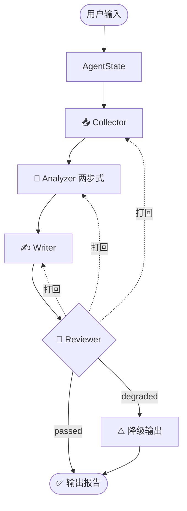

# 🛰️ AI Competitive Radar

> **多 Agent 协作的竞品分析系统** — 字节跳动 AI 全栈挑战赛 Topic 3

[](https://ai-competitive-radar-web.onrender.com/)
[](https://python.org)
[](LICENSE)

**一句话输入 → 结构化竞品报告**

输入「分析 X 和 Y 在 Z 维度的差距」，自动产出：功能对比矩阵 / 用户痛点 / 定价策略 / SWOT / 优先级建议——**每条结论可溯源到原始证据**。

🔗 **在线体验**：https://ai-competitive-radar-web.onrender.com/

---

## ✨ 核心特性

| 能力 | 说明 |
|------|------|
| 🤝 **四 Agent 流水线** | 采集 → 分析（两步式）→ 撰写 → 质检，LangGraph 编排 |
| 🔗 **结论级证据溯源** | 每条结论带 `[SXXXXXXX]` chip，一键跳转原文 |
| 🔁 **质检反馈闭环** | Reviewer 跑 R0–R10 规则，不合格打回，最多 2 轮 |
| 🪂 **三层采集降级** | live → cache → mock；Brave → Tavily → DuckDuckGo |
| 🧩 **配置驱动跨行业** | 换行业只改 `config/*.yaml`，代码零改动 |

---

## 🏗️ 系统架构



---

## 🚀 快速开始

### 方式 1：在线体验（推荐）

直接访问 👉 https://ai-competitive-radar-web.onrender.com/

> ⚠️ 免费实例首次加载可能需要 30-60 秒冷启动

### 方式 2：本地运行

详见 **[SETUP.md](SETUP.md)** — 完整的环境配置步骤

```powershell
# 1. 克隆项目
git clone https://github.com/yangyuxin-hub/AI-Competitive-Radar.git
cd AI-Competitive-Radar

# 2. 安装依赖
python -m venv .venv
.\.venv\Scripts\Activate.ps1
pip install -r requirements.txt

# 3. 配置环境变量
cp .env.example .env
# 编辑 .env 填入 API key

# 4. 启动（二选一）

# A. CLI 模式
$env:ANALYZER_MOCK="1"  # Mock 模式，无需 API key
python -m src.graph

# B. Web 工作台模式
# 终端 1：后端
.\.venv\Scripts\python.exe -m uvicorn api.main:app --port 8000
# 终端 2：前端
cd web ; npm install ; npm run dev
# 浏览器打开 http://localhost:3000
```

---

## ⚙️ 环境变量

| 变量 | 用途 | 默认 |
|------|------|------|
| `ARK_API_KEY` | 火山豆包 API key | unset（非 Mock 必填） |
| `ARK_EP` | 模型 endpoint id | unset（非 Mock 必填） |
| `LLM_API_KEY` | LLM API key（优先级更高） | unset |
| `LLM_MODEL` | 模型 id | `doubao-seed-2-0-lite-250428` |
| `LLM_BASE_URL` | API 地址 | `https://ark.cn-beijing.volces.com/api/v3` |
| `BRAVE_API_KEY` | 搜索 key（可选） | unset（自动降级 DuckDuckGo） |
| `DOMAIN` | 行业域 | `ai_coding` |
| `API_CORS_ORIGINS` | 生产前端域名 | unset |

---

## 📂 目录结构

```
AI-Competitive-Radar/
├── src/                    # Python 后端核心
│   ├── graph.py           # LangGraph 编排入口
│   ├── collector.py       # 采集 Agent
│   ├── analyzer.py        # 分析 Agent
│   ├── writer.py          # 撰写 Agent
│   └── reviewer.py        # 质检 Agent
├── api/
│   └── main.py            # FastAPI 后端
├── web/                   # Next.js 前端
├── config/                # 产品/行业/评分配置
├── prompts/               # LLM Prompt 模板
├── data/                  # Mock 数据 + 缓存
├── tests/                 # 201 个测试用例
├── requirements.txt       # Python 依赖
├── .env.example           # 环境变量示例
├── SETUP.md               # 详细配置指南
└── DEPLOY.md              # 部署指南
```

---

## 🌐 部署

详见 **[DEPLOY.md](DEPLOY.md)**

```bash
# 生产启动
uvicorn api.main:app --host 0.0.0.0 --port 8000
```

**要点**：
- **不要上 Serverless** — SSE 长连接需长驻进程
- **反向代理关 SSE 缓冲** — Nginx 需 `proxy_buffering off;`
- **CORS** — 设 `API_CORS_ORIGINS=https://你的前端域名`

---

## 🧪 测试

```bash
pytest -q  # 201 passed
```

---

## 👤 作者

**杨雨欣** — GitHub [@yangyuxin-hub](https://github.com/yangyuxin-hub)

🔗 https://github.com/yangyuxin-hub/AI-Competitive-Radar
