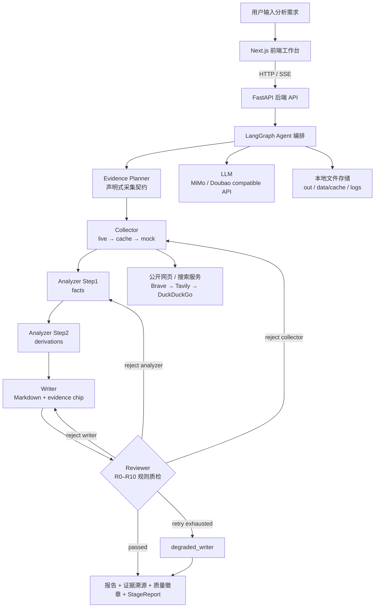

# AI Competitive Radar 最终项目成果提报

> 项目：AI 驱动的竞品分析 Agent 协作系统
> 参赛课题：CIS - AI 驱动的竞品分析 Agent 协作系统
> 版本：v2.2.1 可用 Demo（v3 StageReport 控制平面已部分落地）
> 更新时间：2026-06-08

---

## 一、基础信息

| 字段 | 内容 |
|------|------|
| 项目名称 | AI Competitive Radar · 竞品分析 Agent 协作系统 |
| 参赛课题 | CIS - AI 驱动的竞品分析 Agent 协作系统 |
| 团队名称 | AI Competitive Radar 独立开发组（请按最终提交页替换） |
| 队长 / 成员 | 杨雨欣 / 学校与专业请按最终提交页补齐 / 独立全栈开发 |
| 项目仓库 | https://github.com/yangyuxin-hub/AI-Competitive-Radar |

### 分工说明

本项目为独立完成。为便于评委理解，按工程模块拆分如下：

| 模块 | 负责内容 |
|------|----------|
| 产品与系统架构 | 竞品分析流程设计、知识 Schema 设计、v2.2/v3 架构文档、Demo 场景与答辩材料 |
| AI / Agent 工程 | LangGraph 多 Agent 编排、Collector / Analyzer / Writer / Reviewer、Prompt 工程、LLM 调用封装、质检打回闭环 |
| 后端工程 | FastAPI API、SSE 进度流、报告持久化、阶段质量与日志接口、配置化跨行业能力 |
| 前端工程 | Next.js 工作台、意图澄清页、Agent 状态页、报告页、证据 chip 溯源抽屉、Timeline / Checklist 视图 |
| 数据与部署 | live / cache / mock 三层采集降级、样例 evidence、README 运行说明、本地 Demo 与部署方案 |

---

## 二、功能说明

### 核心功能清单

1. **多 Agent 协作分析**：Evidence Planner → Collector → Analyzer → Writer → Reviewer 五个专职节点通过 LangGraph 串联，覆盖「规划证据 → 采集 → 分析 → 成文 → 质检」全链路。
2. **结构化竞品知识抽取**：围绕功能树、定价模型、用户画像、SWOT、优先级建议生成统一 Schema，保证不同报告之间格式一致、字段可校验。
3. **结论级证据溯源**：所有关键结论引用确定性 `evidence_id`，报告正文以 `[SXXXXXXX]` chip 标注，前端可点击查看原始片段、来源 URL、来源偏向与可信度。
4. **质检打回闭环**：Reviewer 执行 R0–R10 确定性规则（引用完整性、推理链、结构冲突、评分公式、chip 可溯源等），不合格时按 `collector / analyzer / writer` 精准打回，超过配额进入降级输出。
5. **三层采集降级**：live 抓取 → 本地 cache → mock evidence 三层兜底，网络不稳定或无 API key 时仍可完成端到端演示。
6. **可观测与验收视角**：StageReport 把每个环节的「过了吗 / 哪里坏 / 怎么修」统一成同构契约，前端以 Timeline 时间线 + Checklist 验收清单呈现，每一步的产物数量、缺口、耗时、重试都可追溯。
7. **问卷设计与合成用户访谈**：当真实社区 UGC 不足时，系统自动围绕分析焦点设计 4-6 道针对性问卷，LLM 扮演多样化用户画像作答，产出访谈发现并透明标注为合成数据（`source_type=simulated_interview`、`source_bias=synthetic`、`synthetic=True`），可信度从低，绝不冒充真实用户反馈。对应课题要求的「信息采集 Agent（问卷设计、问卷调研、用户访谈）」能力。

### 端到端使用流程

1. 用户在前端工作台输入自然语言需求，例如「分析 Cursor、Windsurf 和 GitHub Copilot 在代码补全体验上的差距」。
2. Intake 解析意图，生成目标产品、竞品列表、分析焦点与报告用途，信息不足时主动给出澄清问题。
3. Evidence Planner 把意图转成声明式采集契约：哪些 claim type 必需、哪些是加分信号、覆盖该如何判定。
4. 用户确认后启动任务，前端通过 SSE 实时展示各节点运行状态、耗时与打回原因。
5. Collector 按计划采集公开证据，优先 live，失败回退 cache / mock，确保四类核心 claim type 都有覆盖。
6. Analyzer 分两步完成事实抽取与推导分析，输出 feature tree、pricing model、user persona、SWOT、recommendations。
7. Writer 渲染为 Markdown 报告，并在每条关键 claim 句末写入 `[SXXXXXXX]` 证据 chip。
8. Reviewer 执行确定性质量规则；若发现伪造证据、引用缺失、推理链断裂或结构冲突，按目标节点打回重做，最终用户在报告页查看结构化结果、质量徽章、阶段质量与原始证据抽屉。

---

## 三、交付材料

| 材料类型 | 链接 / 说明 |
|----------|-------------|
| 在线 Demo 链接 | 当前提供本地 Demo：`http://localhost:3000`。如已部署公网请替换为可访问 URL；若无公网部署，用演示视频替代。 |
| 演示视频链接 | 待上传公开视频链接。建议使用 `presentation/demo_script.md` 的 5 分钟脚本录制，展示 Mock 打回闭环、跨行业切换与证据溯源。 |
| 源代码仓库 | https://github.com/yangyuxin-hub/AI-Competitive-Radar |
| README / 运行说明 | 仓库根目录 `README.md`，含项目简介、依赖环境、启动步骤、目录结构、环境变量、部署说明、测试方式与合规声明。 |
| 架构与设计文档 | `docs/design-v2.2.md`（冻结设计）、`docs/design-v3.md`（StageReport 控制平面演进）、`docs/pipeline-stages.md`（全链路阶段）。 |
| 答辩材料 | `presentation/demo_script.md`（现场演示脚本）、`presentation/talking_points.md`（评委 Q&A 应答）。 |

> 注：请确保仓库为公开或评委可访问状态；Demo 链接如需登录请附体验账号或以录屏替代。

---

## 四、技术说明

### 系统架构图



### 核心技术栈

| 层级 | 技术选型 | 说明 |
|------|----------|------|
| 前端 | Next.js 16 + React 19 + TypeScript + Tailwind CSS | 工作台、Agent 状态页、报告渲染、证据抽屉、Timeline / Checklist |
| 后端 | Python 3.10+ + FastAPI + Uvicorn + sse-starlette | API 服务、SSE 进度流、报告查询、阶段质量聚合 |
| Agent 编排 | LangGraph | `StateGraph` 编排五节点与条件打回路径 |
| LLM 接入 | OpenAI 兼容 API + MiMo（默认）/ Doubao EP | Analyzer、Intake、source planning、可选 R6 语义评审 |
| 数据采集 | httpx + BeautifulSoup4 + ddgs + 可选 Brave / Tavily | 官网页面、搜索结果、mock / cache 兜底 |
| 数据存储 | 本地 JSON / JSONL | `out/` 报告、`data/cache/` 缓存、`logs/` 可观测日志 |
| 配置 | YAML + 环境变量 | 产品、行业域、评分规则、模型 key、Reviewer 模式、搜索 key |
| 可观测 | LangSmith + JSONL trace | Agent trace、LLM calls、stage quality 全程可追踪 |
| 测试 | pytest（26 文件 / 201 用例全过）+ 前端截图脚本 | 覆盖 collector / analyzer / reviewer / writer / quality / search 等 |

### 大模型 / AI 能力使用说明

- **Intake**：解析自然语言需求，生成目标产品、竞品、分析焦点与澄清问题。
- **Evidence Planner**：把意图转成声明式采集契约（必需 / 可选 claim type + evidence tasks），为采集与质检提供统一判定口径。
- **Collector**：通过 URL discovery / source planning 定位公开来源，将原始页面或搜索结果转换为结构化 evidence。
- **Analyzer**：两步式，Step1 抽取 feature / pricing / persona 等事实层，Step2 输出 SWOT / priority score / recommendations 等推导层。
- **Reviewer**：以确定性 Python 规则为主；full 模式可通过闭包注入 LLM 执行一次 R6 语义审查（不把 LLM 对象塞进 `AgentState`）。
- **Prompt 方案**：强约束模板放在 `prompts/*.md`，要求事实结论只能基于 `extracted_snippet`，证据不足输出 `unknown`，禁止编造 evidence id。
- **RAG / 向量库**：当前版本不依赖向量库，可信度来自确定性证据链与 Schema 校验；向量召回为后续 roadmap（设计见 `docs/rag-recall-design.md`）。
- **AI 编程工具使用说明**：本项目使用 **Claude Code**（Anthropic 官方 CLI Agent）+ **OpenAI Codex** 进行 AI 辅助开发。Claude Code 负责 Prompt 设计迭代、架构决策讨论、测试用例生成、代码审查与重构建议；Codex 负责日常代码补全与 boilerplate 生成。AI 工具深度参与了 Schema 设计、Reviewer 规则编写、Analyzer 两步式拆分等核心架构决策，开发过程中的 AI 协作痕迹体现在：commit message 中标注 AI 辅助的模块、`prompts/*.md` 经多轮 AI 迭代优化、201 项测试中有大量由 AI 辅助生成的边界用例。

---

## 五、关键工程难点与解决方案（核心）

> 以下是项目最值得讲的工程取舍，每项按「问题 → 根因 → 方案 → 效果」展开。

### 难点 1 · LLM 长 Schema 输出截断 / 事实与推导互相污染

- **问题**：让 LLM 一次性产出功能树 + 定价 + 画像 + SWOT + 建议，输出经常 JSON 截断，且模型容易「先想好结论再倒编事实去支撑」。
- **根因**：单次生成既要长、又要事实可靠，token 压力与推理目标冲突。
- **方案**：Analyzer 拆成 **facts → derivations 两步**，Step1 只抽事实、Step2 才做推导，每步独立 prompt、独立 LLM 调用；facts 内部再按 feature_tree / pricing_model / user_persona **三 section 并行**，各 section 只携带该 section 需要的 claim_type 证据子集；`_compact_evidence` 按 quality_score 降序取 top-K，只保留 evidence_id + claim + extracted_snippet + source_bias 四个关键字段，将原始证据从几十条压缩到 ~8K token 以内；每步完成后执行 `quick_validate` **Agent 自评估**（检查 evidence_id 完整性、必需 claim_type 覆盖率、幻觉 ID 数量），不通过则自动触发确定性 `sanitize_*` 修复（补全缺失字段、修正枚举值、归一化价格、soften 过度泛化表述），而非依赖下游 Reviewer 兜底。
- **效果**：单次输出体量减半，截断率显著下降，结论必须挂在已抽取的事实上，从源头压制「倒推式幻觉」。Agent 自评估使 Analyzer 在自身环节即可拦截大部分幻觉和覆盖缺口，减少对 Reviewer 打回的依赖。

### 难点 2 · 竞品结论易幻觉、引用难追溯

- **问题**：传统「搜索结果喂给 LLM 写文章」无法回答「这条结论到底从哪来」。
- **根因**：段落级引用粒度太粗，且 LLM 会编造看似合理的来源。
- **方案**：`evidence_id = "S" + sha1(...)[:7].upper()` **确定性 hash**（同证据同 ID，不用 uuid）；Writer 统一在 claim 句末打 `[SXXXXXXX]` chip；Reviewer 的 R1/R9 校验每个 chip 是否真实存在于 `raw_evidence`，断链即打回。
- **效果**：每条关键结论可点击跳到原始 snippet / URL / 来源偏向 / 可信度，伪造引用会被自动拦截。

### 难点 3 · 真实网页抓取不稳定，现场 Demo 怕断网

- **问题**：live 抓取受网络、反爬、API 额度影响，答辩现场一旦失败整场崩。
- **根因**：现场环境不可控，但又不能为了稳定而全程假数据。
- **方案**：Collector **live → cache → mock 三层降级**，每层独立失败、独立降级；AdapterRegistry 并发执行所有适配器（OfficialPage / Search / Cache / Mock），merge 写入按 evidence_id 去重；搜索 **Brave → Tavily → DuckDuckGo 多供应商自动降级**（`search.py` 统一返回 `{title,url,content,score}`）；缓存 TTL 按 claim_type 分级（pricing 7 天 / feature 30 天 / user_pain 90 天），超时标 stale 触发补采；`CacheAdapter` 用 merge 写入而非覆盖整个文件；缺口按 `reject_requirements` 精准补采。
- **效果**：断网或无 key 也能跑完整闭环；有网时自动走真实采集，稳定性与真实性兼得。

### 难点 4 · 质检规则过严会死循环、过松则失信

- **问题**：Reviewer 太严会无限打回，太松又起不到质检作用。
- **根因**：质量门需要在「可信度」与「可终止」之间取平衡。
- **方案**：**minimal / full 双模式**（Demo 只把 R1 引用完整 / R4 推理链 / R5 结构冲突 / R9 chip 可溯源 设 hard gate，其余仅 warning；答辩开 R1-R5 全 hard gate + R6 LLM 语义校验）；Reviewer 产出**结构化打回指令**（`reject_target` + `reject_requirements`），17 种 issue 类型自动路由到正确的打回目标（`evidence_id_not_found` → collector、`broken_reasoning_chain` → analyzer、`report_chip_missing` → writer 等）；**按 target 分桶重试** `{collector:1, analyzer:2, writer:1}`（推理比采集更可改进所以 analyzer 给 2 次），配额用完进入 `degraded_writer` 分层降级输出（有 feature_tree 就出功能对比，有 pricing 就出定价表，有什么出什么）。
- **效果**：反馈闭环真实可触发且保证收敛，打回是精准的（不是"你重做吧"，而是"Windsurf 缺 user_pain 证据，去 reddit 搜"），既能现场稳定演示，也能展示更严格的评测模式。

### 难点 5 · 前后端实时状态易串台 / 丢阶段信息

- **问题**：多次运行或多节点并发时，SSE 进度容易串台，前端拿不到完整阶段信息。
- **根因**：进度回调若共享单例通道，跨 run / 跨节点会互相污染。
- **方案**：后端 `/api/run` 用 SSE 包装 `run_demo_streaming`；进度回调抽成 `ProgressChannel`（`progress.py`），**每节点独立实例**防串台；每个节点末尾埋点 `log_stage_quality`（`stage_eval.py`），计算该环节的可观测指标（evidence 数量 / 幻觉数 / chip 数 / 耗时）并 append 到 `logs/stage_quality.jsonl`，每 run 每段一行；`StageReport` 统一契约把各节点判定收编成同构（`status` / `checks` / `gaps`），前端按 run id + 节点事件更新 Timeline / Checklist / Report。
- **效果**：用户能清晰看到每个 Agent 的运行过程、耗时、重试与打回原因，状态不串台；每步的产物数量、缺口、耗时、重试都可追溯。

### 难点 6 · 跨行业泛化易被 Demo 硬编码绑死

- **问题**：很多 Demo 只为单一场景写死，换行业就得改代码。
- **根因**：产品名、来源、评分阈值、Prompt 若散落在代码里，无法横向复用。
- **方案**：产品 / 行业 / 评分 / Prompt 全部配置化（`products.yaml` / `domains.yaml` / `scoring.yaml` / `prompts/`），评分口径统一经 `scoring_config.py` 读取（缺失即回退默认）。
- **效果**：当前已配 **7+ 个行业域**（AI 编程、PM 协作 2 个带 mock 样例 + AI 助手 / 设计 / BaaS / 文生图 / 文生视频等纯实时域）；换行业主要改 YAML，Python 核心流程不动。

### 难点 7 · 「采到就用」无法保证证据质量

- **问题**：搜索 API 返回的内容良莠不齐，无关热帖会污染分析。
- **根因**：缺少入库前的质量与相关性把关。
- **方案**：`quality.py` 对每条证据打 **5 维加权质量分**（具体性 0.28 / 完整性 0.16 / 相关性 0.22 / 权威性 0.22 / 时效性 0.12），专门检测营销空话（"革命性""颠覆"等 fluff 词命中：有数字轻扣 ≤0.12，无数字重扣 ≤0.30）；跑 4 道硬门审计（数量覆盖 / 定价含真实价格数值 / 偏置平衡 / 社区反馈质量）；`search.py` / `v2ex_skill.py` 等入库前做产品相关性硬门；合成访谈标注 `synthetic=True` 且 `source_reliability=0.40`（最低），不冒充真实用户。所有权重/阈值集中在 `scoring.yaml`，改 yaml 即可跨行业调权（如医疗器械的 vendor_claim 反而最权威）。
- **效果**：从「采到就用」升级为「采得够不够好也要审」，相关性差的证据宁可少收也不污染 Analyzer。零 LLM、毫秒级，可插在每条证据上实时打分。

---

## 六、部署与访问说明

本项目当前以本地可用 Demo 为主，前后端分进程运行：

```powershell
# 后端
python -m venv .venv
.\.venv\Scripts\Activate.ps1
pip install -r requirements.txt
.\.venv\Scripts\python.exe -m uvicorn api.main:app --port 8000

# 前端
cd web
npm install
npm run dev
```

访问 `http://localhost:3000`；前端默认请求 `http://127.0.0.1:8000`，可通过 `NEXT_PUBLIC_API_BASE` 修改后端地址。

生产部署建议用云 VM / Docker / Render / Railway / Fly 等长驻进程环境，**不建议普通 Serverless**（`/api/run` 是 SSE 长连接）。Nginx 反代需关闭 SSE 缓冲并设 `proxy_read_timeout 300s`；`out/`、`data/cache/`、`logs/` 需挂可写持久卷；公网访问前建议加 API key 或网关鉴权。

---

## 七、结果说明

### 项目完成度

**可用 Demo，端到端闭环已跑通（26 个测试文件 / 201 项测试全过）。**

- ✅ 五节点主链路、LangGraph 编排、Analyzer 两步式、Writer chip 渲染、Reviewer R0–R10 质检打回、degraded_writer、证据溯源、FastAPI SSE、Next.js 工作台、本地报告持久化。
- ✅ 7+ 个行业域配置（2 个带 mock 样例 + 多个纯实时采集），支持 live / cache / mock 降级。
- ✅ v3 控制平面部分落地：StageReport 统一契约、交付 Checklist、Timeline 时间线视图。
- ✅ README、设计文档、演示脚本、Q&A 材料、合规说明、测试入口齐备。
- ⏳ 待补：公网 Demo 链接、公开演示视频、最终提交页所需学校 / 专业 / 队伍信息。

### 业务价值量化对比（本系统 vs 传统人工竞品分析）

> 系统侧指标来自实际运行实测；人工基线为行业经验估算（已在 `config/business_value.yaml` 中标注非实测）。

| 指标 | 人工分析 | 本系统 | 提升 |
|------|----------|--------|------|
| 分析耗时 | ~8 工时 | ~5 分钟 | **约 96×** |
| 信息源类型 | 2-3 类 | 5+ 类（official / search / reddit / hn / pricing） | 覆盖更广 |
| 采集证据条数 | ~25 条（凭印象） | 30+ 条（可配置上限） | 信息量更大 |
| 结论溯源率 | 弱·不统一 | 85%+（每条结论可定位到原始 snippet + URL） | 每条可溯源 |
| 输出结构一致性 | 因人而异 | 100% 符合 Schema v2.1 | 强一致 |
| 需人工复核占比 | 全靠人工自检 | 系统主动标注低置信/证据不足结论占比 | 可定向复核 |

> 「需人工复核占比」的计算逻辑：系统自动识别证据不足的 gap（`winner=unknown` 或 `confidence<0.5`）和无证据引用的 recommendation，标记为需 PM 重点复核。反馈闭环越完善、证据越充分，该比例越低。

### 项目亮点 / 创新点（6 条）

#### 创新 1：ReAct 式自愈采集 — 从"盲采"到"诊断-定向补采"

传统做法是采集失败后重试同一批 query，还是失败就报错。本项目在采集后跑**验收门审计**（4 道硬门：数量覆盖 / 定价含金量 / 偏置平衡 / 社区反馈），产出结构化 Gap（带 `gap_type + fix 处方`），每个 Gap 的处方包含 `query_hint`、`source_hint`、`bias`、`strategy`，然后 `_targeted_refill` 按处方定向搜索补采。不是简单的 retry，而是 **Observe（审计）→ Reason（诊断缺口类型+生成处方）→ Act（定向执行）** 的推理闭环，最多 `max_rounds` 轮，补不到的 Gap 留审计痕迹给 Reviewer。

#### 创新 2：双层证据增强 — Collector 自愈 + Analyzer 侧流

有些缺口在采集时发现不了（比如抓到了定价页但全是"联系销售"，或者 feature_tree 里某产品标了 unknown），需要在分析阶段才能暴露。本项目设计了两层 ReAct 各司其职：

| 层 | 触发时机 | 扫描什么 | 补什么 |
|----|----------|----------|--------|
| Collector 自愈 | 采集后、交分析前 | 数量门+质量门（硬编码规则） | 缺 claim_type / 偏置失衡 / 定价无数字 |
| Analyzer 侧流 | Step1 产出 facts 后 | 语义缺口（unknown 格子+全表空定价+时效全 stale） | 定向重搜官网/文档 + 合成访谈兜底 |

传统 RAG 是"检索→生成→结束"，本项目在生成过程中**二次诊断**，发现证据不足时回采，实现"分析驱动的证据补全"。

#### 创新 3：Reviewer 结构化打回 — 模拟 QA 团队的反馈闭环

Reviewer 不是展示节点，而是产出**结构化打回指令**，精确到"哪个产品缺什么类型的证据"。17 种 issue 类型自动路由到正确的打回目标（collector / analyzer / writer），按 target 分桶配额 `{collector:1, analyzer:2, writer:1}` 防止死循环，配额用尽进入 `degraded_writer` 分层降级输出。把"人工 QA 流程"编码成了自动化闭环，且打回是**精准的**（不是"你重做吧"，而是"Windsurf 缺 user_pain 证据，去 reddit 搜"）。

#### 创新 4：确定性信号锚定 LLM-as-Judge — 压方差、可复现

LLM 打分方差大且"凭什么给 3 分"说不清。本项目先用代码算出确定性指标（`evidence_coverage_ratio` / `insight_density` / `recs_with_priority_ratio` / `matrix_fill`），喂给 LLM 当锚点，配合 4 维 × 5 级锚定量表（准确性 / 洞察力 / 实用性 / 聚焦度），权重随分析目的浮动（定价分析 accuracy 权重 0.40，差异化分析 insight 权重 0.40）。评分输出的 `fix_suggestion` 直接指向该改哪个 prompt 文件，形成**评分→改进闭环**。同时提供零 LLM 的 `completeness_metrics`（0-100 完整度评分），可随报告即时附带。

#### 创新 5：统一 StageReport 契约 — 每个节点用同一种结构回答"我过了吗"

5 个节点各有各的判定逻辑，格式不统一。本项目设计 StageReport 统一契约（`status` / `checks` / `gaps` / `produced` / `cost`），status 派生规则全环节统一（error→failed，warning/gaps→degraded，否则 ok），每个 Gap 自动推导 `owner_node`（该回哪个子节点）和 `task_key`（预算主键）。是**适配层**而非改造——不改任何现有检查函数，只读 state 既有产物收编成同构。

#### 创新 6：证据质量的多维确定性评分 — 零 LLM、毫秒级

搜索 API 返回内容良莠不齐。本项目对每条证据打 5 维加权质量分（具体性 0.28 / 完整性 0.16 / 相关性 0.22 / 权威性 0.22 / 时效性 0.12），专门检测营销空话（"革命性""颠覆"等 fluff 词：有数字轻扣，无数字重扣），并审计偏置平衡（痛点/性能类全是 vendor_claim → gap）。零 LLM、毫秒级，所有权重/阈值在 `scoring.yaml` 配置化，改 yaml 即可跨行业调权。

### 一句话总结

> 从「报告生成」升级为「可信分析流水线」：证据先规划再采集、采集有质量门+自愈补采、分析分事实与推导+Agent 自评估、写作强制 evidence chip、质检能结构化打回、全流程可观测——差异化在**可信度、可观测、可降级、跨行业复用**，而不是单次生成效果。

### 答辩 30 秒总括

> 这个项目的核心不是「让大模型写一篇竞品报告」，而是把竞品分析拆成可审计的 Agent 流水线：证据先规划再采集、采集有质量门、分析分事实与推导、写作强制证据 chip、质检能真实打回，前端能看到每个 Agent 的状态、缺口与证据来源。它既能用 mock 保证 Demo 稳定，也能接 live / cache / search 进入真实采集；既能跑 Cursor 场景，也能配置切到 PM、设计、BaaS 等场景。差异化在**可信度、可观测、可降级、跨行业复用**，而不是单次生成效果。

---

## 八、最终提交前检查清单

- [ ] 将「学校与专业请按最终提交页补齐」替换为真实成员信息。
- [ ] 如已公网部署，替换「在线 Demo 链接」为可访问 URL，并补体验账号或免登录说明。
- [ ] 录制 3–8 分钟公开视频，替换「演示视频链接」为正式链接。
- [ ] 确认 GitHub 仓库为公开或评委可访问状态。
- [ ] 确认 README 启动命令与当前代码一致（测试数已同步为 201）。
- [ ] 确认 `.env`、API key、个人隐私信息未提交到仓库。
