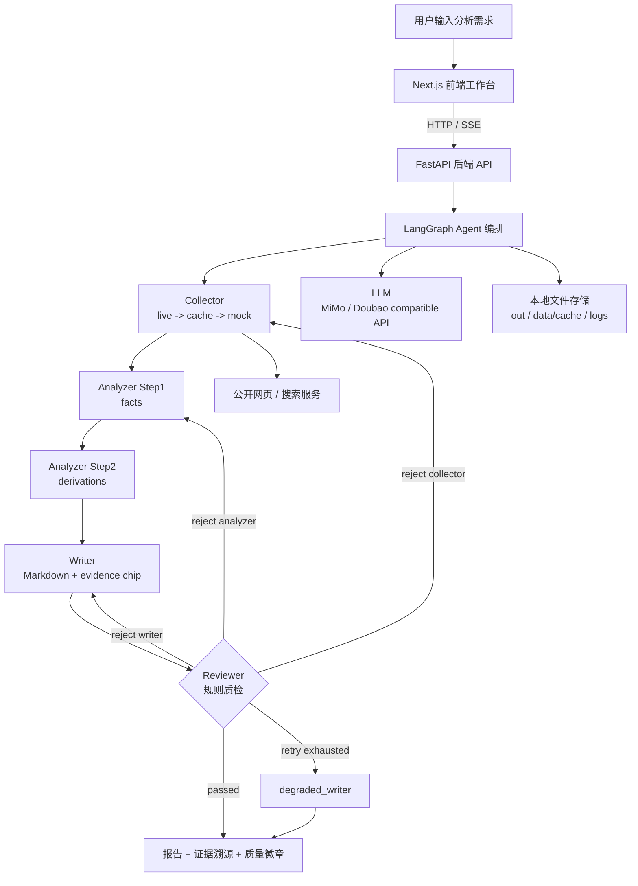

# AI Competitive Radar 最终项目成果提报

> 项目：AI 驱动的竞品分析 Agent 协作系统  
> 参赛课题：CIS - AI 驱动的竞品分析 Agent 协作系统  
> 版本：v2.2.1 可用 Demo  
> 更新时间：2026-06-08

## 一、基础信息

| 字段 | 内容 |
|------|------|
| 项目名称 | AI Competitive Radar · 竞品分析 Agent 协作系统 |
| 参赛课题 | CIS - AI 驱动的竞品分析 Agent 协作系统 |
| 团队名称 | AI Competitive Radar 独立开发组（可按最终提交页替换） |
| 队长 / 成员 | 杨雨欣 / 学校与专业请按最终提交页补齐 / 独立全栈开发 |
| 项目仓库 | https://github.com/yangyuxin-hub/AI-Competitive-Radar |

### 分工说明

本项目为独立完成。为便于评委理解，按工程模块拆分如下：

| 成员 | 角色 | 负责模块 |
|------|------|----------|
| 杨雨欣 | 产品与系统架构 | 竞品分析流程设计、Schema 设计、v2.2.1 架构文档、Demo 场景设计、答辩材料 |
| 杨雨欣 | AI / Agent 工程 | LangGraph 多 Agent 编排、Collector / Analyzer / Writer / Reviewer、Prompt 工程、LLM 调用封装、质检打回闭环 |
| 杨雨欣 | 后端工程 | FastAPI API、SSE 进度流、报告持久化、日志与阶段质量接口、配置化跨行业能力 |
| 杨雨欣 | 前端工程 | Next.js 工作台、意图澄清页、Agent 状态页、报告页、证据 chip 溯源抽屉 |
| 杨雨欣 | 数据与部署 | Mock / cache / live 三层采集降级、样例 evidence、README 运行说明、本地 Demo 与部署方案 |

## 二、功能说明

### 核心功能清单

- 多 Agent 协作分析：Collector、Analyzer、Writer、Reviewer 四个专职 Agent 通过 LangGraph 串联，覆盖采集、分析、成文与质检。
- 结构化竞品知识抽取：围绕功能树、定价模型、用户画像、SWOT、优先级建议生成统一 Schema，保证不同报告格式一致。
- 结论级证据溯源：所有关键结论引用确定性 `evidence_id`，报告正文以 `[SXXXXXXX]` chip 标注，前端可点击查看原始片段和来源 URL。
- 质检打回闭环：Reviewer 执行引用完整性、推理链、结构冲突、评分公式等规则，不合格时按 `collector / analyzer / writer` 精准打回，超过配额进入降级输出。
- 三层采集降级：公开网页 live 抓取、本地 cache、mock evidence 三层兜底，保证网络不稳定或无 API key 时仍可完成端到端演示。
- 配置化跨行业演示：通过 `config/domains.yaml`、`config/products.yaml` 和样例数据切换行业，当前覆盖 AI 编程工具与 PM 协作工具两个 Demo 域。

### 端到端使用流程

1. 用户打开前端工作台，在输入框中输入自然语言需求，例如“分析 Cursor、Windsurf 和 GitHub Copilot 在代码补全体验上的差距”。
2. Intake 模块解析用户意图，生成目标产品、竞品列表、分析焦点和报告用途，并在信息不足时给出澄清问题。
3. 用户确认配置后启动分析任务，前端通过 SSE 实时展示 Collector、Analyzer、Writer、Reviewer 的运行状态。
4. Collector 根据产品配置采集公开证据，优先使用 live 数据，失败时自动回退到 cache 或 mock，确保四类 claim type 都有覆盖。
5. Analyzer 分两步完成事实抽取和推导分析，生成 feature tree、pricing model、user persona、SWOT 和 recommendations。
6. Writer 将结构化结果渲染为 Markdown 竞品报告，并在每条关键 claim 末尾写入 `[SXXXXXXX]` 证据 chip。
7. Reviewer 执行确定性质量规则，若发现伪造证据、引用缺失、推理链断裂或结构冲突，会按目标节点打回重做。
8. 用户最终在报告页查看结构化竞品分析结果、质量徽章、阶段质量、原始证据抽屉，并可下载或复用报告材料。

## 三、交付材料

| 材料类型 | 链接 / 说明 |
|----------|-------------|
| 在线 Demo 链接 | 当前提供本地 Demo：`http://localhost:3000`。如已部署公网，请将此处替换为最终可访问 URL；若无公网部署，用演示视频替代。 |
| 演示视频链接 | 待上传公开视频链接。建议使用 `presentation/demo_script.md` 的 5 分钟脚本录制，展示 Mock 打回闭环、跨行业切换和证据溯源。 |
| 源代码仓库 | https://github.com/yangyuxin-hub/AI-Competitive-Radar |
| README / 运行说明 | 仓库根目录 `README.md`，包含项目简介、依赖环境、启动步骤、目录结构、环境变量、部署说明、测试方式和合规声明。 |
| 架构与设计文档 | `docs/design-v2.2.md` 为冻结设计；`docs/design-v3.md` 为 StageReport / 控制平面演进设计；`docs/pipeline-stages.md` 展示全链路阶段。 |
| 答辩材料 | `presentation/demo_script.md` 为现场演示脚本；`presentation/talking_points.md` 为评委 Q&A 应答模板。 |

## 四、技术说明

### 系统架构图



### 核心技术栈

| 层级 | 技术选型 | 说明 |
|------|----------|------|
| 前端 | Next.js 16 + React 19 + TypeScript + Tailwind CSS | 工作台界面、Agent 状态页、报告渲染、证据抽屉、Markdown GFM 表格 |
| 后端 | Python 3.10+ + FastAPI + Uvicorn + sse-starlette | API 服务、SSE 进度流、报告查询、阶段质量聚合 |
| Agent 编排 | LangGraph | `StateGraph` 编排四 Agent 与条件打回路径 |
| LLM 接入 | OpenAI compatible API + MiMo / Doubao EP | Analyzer、Intake、URL / source planning、可选 R6 语义评审 |
| 数据采集 | httpx + BeautifulSoup4 + ddgs + 可选 Brave / Tavily | 官网页面、搜索结果、mock / cache 兜底 |
| 数据存储 | 本地 JSON / JSONL 文件 | `out/` 报告，`data/cache/` 缓存，`logs/` 可观测日志 |
| 配置 | YAML + 环境变量 | 产品、行业域、评分规则、模型 key、Reviewer 模式、搜索 key |
| 可观测 | LangSmith + JSONL trace | Agent trace、LLM calls、stage quality 均可追踪 |
| 测试 | pytest + 前端 Playwright 脚本 | 覆盖 collector、analyzer、reviewer、writer、quality、前端截图验证脚本 |

### 大模型 / AI 能力使用说明

- Intake：解析自然语言需求，生成目标产品、竞品、分析焦点和澄清问题。
- Collector：通过 URL discovery / source planning 辅助定位公开来源，并将原始页面或搜索结果转换为 evidence。
- Analyzer：两步式分析，Step1 负责 feature、pricing、persona 等事实层抽取，Step2 负责 SWOT、priority score、recommendations 等推导层输出。
- Reviewer：默认以确定性 Python 规则为主，full 模式可通过闭包注入 LLM 执行一次 R6 语义审查，避免把 LLM 对象塞进 `AgentState`。
- Prompt 方案：强约束模板放在 `prompts/*.md`，要求所有事实结论只能基于 `extracted_snippet`，证据不足输出 `unknown`，禁止编造 evidence id。
- RAG / 向量库：当前版本未依赖向量库，核心可信度来自确定性证据链与 Schema 校验；向量召回是后续 roadmap，设计见 `docs/rag-recall-design.md`。

### 关键工程难点与解决方案

| 难点 | 解决方案 | 效果 |
|------|----------|------|
| LLM 长 Schema 输出容易截断或事实与推导混在一起 | Analyzer 拆为 facts 和 derivations 两步，每步 quick_validate，并用 Reviewer 做最终 gate | 降低 token 压力，减少“为了结论倒推事实”的风险 |
| 竞品分析结论容易幻觉、引用难追溯 | evidence id 使用确定性 hash；Writer 统一 `[SXXXXXXX]` chip；Reviewer 校验所有引用是否存在于 `raw_evidence` | 每条关键结论可点击溯源，伪造引用能被打回 |
| 真实网页抓取不稳定，现场 Demo 容易受网络影响 | Collector 使用 live、cache、mock 三层降级；搜索服务 Brave、Tavily、DuckDuckGo 多供应商兜底 | 断网或无 key 时仍可跑完整闭环 |
| Reviewer 规则过严会导致死循环，过松会影响可信度 | minimal / full 双模式；按 target 分桶重试 `{collector:1, analyzer:2, writer:1}`；配额用完进入 degraded writer | Demo 可稳定完成，答辩可展示更严格模式 |
| 前后端实时状态容易串台或丢阶段信息 | 后端使用 FastAPI SSE 包装 `run_demo_streaming`，前端按 run id 和节点事件更新 Timeline / Checklist / Report | 用户能看到 Agent 运行过程、耗时、重试和打回原因 |
| 跨行业泛化容易被 Demo 硬编码绑死 | 产品、行业、评分、Prompt 都配置化；当前已支持 `ai_coding` 和 `pm` 两个 domain | 换行业主要改 YAML 与样例 evidence，Python 核心流程不改 |

### 部署与访问说明

本项目当前以本地可用 Demo 为主，前后端分进程运行：

```powershell
# 后端
python -m venv .venv
.\.venv\Scripts\Activate.ps1
pip install -r requirements.txt
.\.venv\Scripts\python.exe -m uvicorn api.main:app --port 8000

# 前端
cd web
npm install
npm run dev
```

访问地址：`http://localhost:3000`。前端默认请求 `http://127.0.0.1:8000`，可通过 `NEXT_PUBLIC_API_BASE` 修改后端地址。

生产部署建议使用云 VM、Docker、Render、Railway 或 Fly 等长驻进程环境，不建议使用普通 Serverless，因为 `/api/run` 是 SSE 长连接。Nginx 反向代理需关闭 SSE 缓冲，并设置 `proxy_read_timeout 300s`。`out/`、`data/cache/`、`logs/` 需要挂载可写持久卷。公网访问前建议加 API key 或网关鉴权。

## 五、结果说明

### 项目完成度

当前完成度：可用 Demo，端到端闭环已跑通。

- 已完成：四 Agent 主链路、LangGraph 编排、Analyzer 两步式、Writer 报告渲染、Reviewer 质检打回、degraded writer、证据 chip 溯源、FastAPI SSE、Next.js 工作台、本地报告持久化。
- 已完成：AI 编程工具与 PM 协作工具两个 Demo domain，支持 mock / cache / live 降级。
- 已完成：README、设计文档、演示脚本、Q&A 材料、合规说明、测试入口。
- 待补齐：最终公网 Demo 链接、公开视频链接、最终提交页所需学校 / 专业 / 队伍信息。

### 项目亮点 / 创新点

- 结论级可信链路：不是只生成一篇摘要，而是建立 `Evidence -> Fact -> Claim -> Insight -> Recommendation` 的可审计链路，报告每条关键结论都有可点击证据 chip。
- 真实可触发的 Agent 反馈闭环：Reviewer 不是展示用节点，而是能检测伪造 evidence id、结构冲突和评分错误，并按目标节点打回重做。
- Demo 稳定性与工程边界兼顾：三层采集降级、minimal / full 质检模式、按 target 分桶 retry，使系统既能现场稳定演示，也能说明向生产化演进的路径。

### 可在答辩中展开的工程亮点

以下内容不只是满足提交字段要求，而是项目本身可以重点讲的工程设计与产品化思考。

| 亮点方向 | 可以怎么讲 | 对评委的价值 |
|----------|------------|--------------|
| 从“报告生成”升级为“可信分析流水线” | 系统不是把搜索结果喂给 LLM 写文章，而是强制走 evidence、facts、derivations、writer、reviewer 的分层链路。每层都有输入输出契约，最后的报告只是链路末端产物。 | 证明不是普通 AI 摘要工具，而是可审计的竞品分析系统。 |
| 结论级溯源而非段落级引用 | 每条 claim 用确定性 hash 生成 `[SXXXXXXX]`，同一证据同一 ID，前端 chip 能跳到原始 snippet、URL、source bias 和可信度。 | 回答“这个结论从哪来”的核心质疑，降低幻觉风险。 |
| Analyzer 两步式防倒推 | Step1 只抽事实，Step2 才做 SWOT 和建议，避免 LLM 先想结论再编事实支撑；quick_validate 负责本地快速自检。 | 展示对 LLM 长输出、JSON 截断、事实幻觉的工程处理。 |
| Reviewer 规则分层 | minimal 模式只把核心不变量设为 hard gate，full 模式用于答辩或严肃评测；R6 LLM judge 只是兜底，R1/R4/R5/R9 等关键规则由确定性 Python 执行。 | 说明不是“LLM 自己审自己”，而是规则与模型分工。 |
| 精准打回与预算控制 | Reviewer 根据 `reject_target` 和 `reject_requirements` 打回 collector、analyzer 或 writer；按目标分桶重试，用完进入 degraded writer。 | 证明反馈闭环是真实可触发且不会无限循环。 |
| 诚实降级 | 证据补不到时不硬编，降级报告显式标注不可得、证据偏薄、建议补采来源。 | 体现“抑制幻觉”的产品态度，宁可未知也不编。 |
| 三层采集兜底 | live 抓取优先，cache 兜底，mock 保底；搜索供应商 Brave、Tavily、DuckDuckGo 可降级。 | 保证现场 Demo 稳定，也说明系统能适应真实网络波动。 |
| 采集质量门 | `quality.py` 对每条证据打质量分，并检查定价是否有真实价格、体验/痛点是否缺少用户或第三方视角、每产品证据数量是否达标。 | 从“采到就用”升级为“采得够不够好也要审”。 |
| Source Ledger 源台账 | `source_ledger.py` 记录历史高质量来源，后续同类任务优先命中高质量官网或社区来源，合成访谈不入台账。 | 展示系统会积累经验，不是每次从零搜索。 |
| Source Planner 信息源规划 | `source_planner.py` 根据 claim type 决定去哪搜什么，体验/痛点优先社区或评论源，功能/定价优先官方源。 | 证明采集不是关键词乱搜，而是按证据类型规划。 |
| 配置化跨行业 | `domains.yaml`、`products.yaml`、`scoring.yaml`、Prompt 模板分离，当前已有 AI 编程工具和 PM 工具两个 domain。 | 回应“是不是只为 Cursor Demo 写死”的质疑。 |
| scoring 配置集中化 | source reliability、TTL、collection gate、priority score 等口径下沉到配置或统一加载器，减少散落硬编码。 | 说明系统具备可维护性和跨行业调参空间。 |
| 业务价值量化 | 报告页包含“vs 传统人工”的效率与证据量对比，README 中展示约快 75 倍、103 条可溯源证据的场景结果。 | 把技术能力落到业务收益，而不只是工程炫技。 |
| 阶段质量评测 | `stage_eval.py` / `stage_report.py` 记录 collector、analyzer、writer、reviewer 的状态、产物数量、缺口和耗时，前端有 StageQuality / Timeline / Checklist。 | 支撑“Agent 协作过程可观测”，评委能看到每一步如何工作。 |
| StageReport 控制平面演进 | v3 设计把每个环节的“是否通过、哪里坏、怎么修”统一成 `StageReport`，控制环只做 advance / repair / degrade。 | 展示系统级架构思考，不只是把 Demo 拼起来。 |
| SSE 实时进度与防串台 | 后端 `/api/run` 用 SSE 推送节点进度；前端按 run id 处理事件，`ProgressChannel` 避免多次运行状态串台。 | 体现真实产品体验和前后端联调质量。 |
| 报告与质检解耦 | Writer 在 Reviewer 之前运行，Markdown 正文禁止出现 `quality_score`，质量徽章由前端从 `quality_report` 单独渲染。 | 说明数据契约严谨，避免报告正文泄漏内部质检字段。 |
| 合成访谈透明标注 | `survey_skill.py` 产出的模拟访谈证据标注 `source_type=simulated_interview`、`synthetic=True`、较低 reliability，不冒充真实用户。 | 回答合规和数据真实性问题。 |
| 相关性硬门 | `search.py`、`v2ex_skill.py` 等在证据入库前做产品相关性过滤，宁可少收也不让无关热帖污染 Analyzer。 | 体现真实采集质量控制，不只是调用搜索 API。 |
| 部署工程意识 | README 明确 SSE 不适合普通 Serverless、Nginx 要关缓冲、`out/` / cache / logs 要挂持久卷、公网前要加鉴权。 | 展示对上线环境的理解，降低“只能本地跑”的印象。 |
| 测试与回归意识 | README 标注当前 147 项测试全过，测试覆盖 collector、analyzer、reviewer、writer、quality、search 等关键模块。 | 说明 Demo 不是脆弱脚本，有回归保护。 |
| 答辩材料完整 | `presentation/demo_script.md` 和 `presentation/talking_points.md` 覆盖 5 分钟演示、应急预案和高频 Q&A。 | 体现交付闭环，评审材料不只是一份代码仓库。 |

### 30 秒总括讲法

如果答辩时间有限，可以这样总结项目亮点：

> 这个项目的核心不是“让大模型写一篇竞品报告”，而是把竞品分析拆成可审计的 Agent 流水线：采集有质量门，分析分事实和推导，写作强制证据 chip，质检能真实打回，前端能看到每个 Agent 的状态、缺口和证据来源。系统既能用 mock 保证 Demo 稳定，也能接 live / cache / search 进入真实采集；既能跑 Cursor 场景，也能通过配置切到 PM 工具场景。它的差异化在可信度、可观测、可降级和跨行业复用，而不是单次生成效果。

## 六、最终提交前检查清单

- [ ] 将“学校与专业请按最终提交页补齐”替换为真实成员信息。
- [ ] 如果已有公网部署，将“在线 Demo 链接”替换为可访问 URL，并补充体验账号或免登录说明。
- [ ] 录制 3-8 分钟公开视频，并将“演示视频链接”替换为正式链接。
- [ ] 确认 GitHub 仓库为公开或评委可访问状态。
- [ ] 确认 README 中的启动命令与当前代码一致。
- [ ] 确认 `.env`、API key、个人隐私信息没有提交到仓库。
