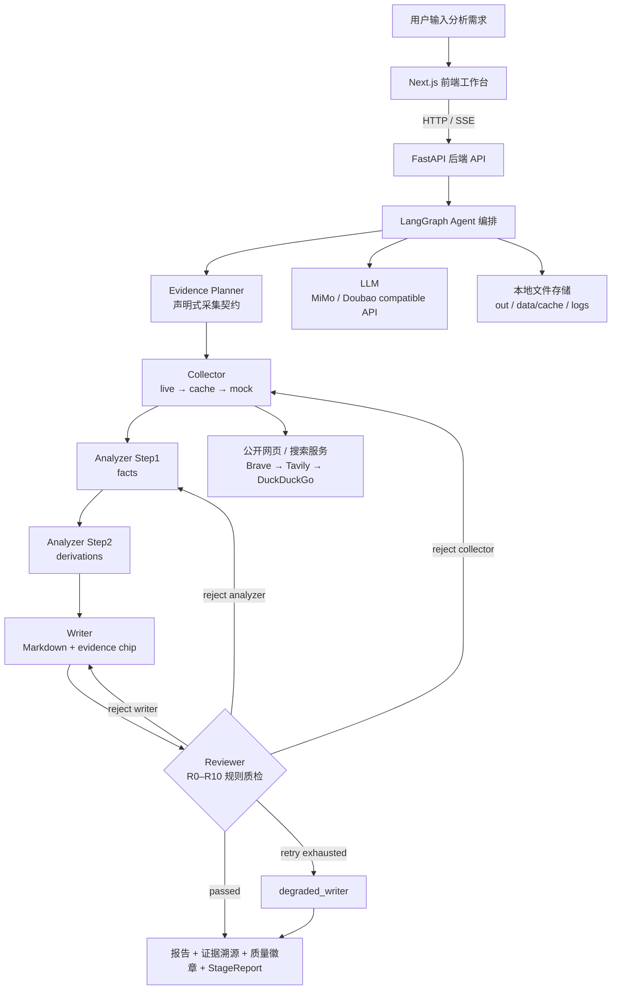

# AI Competitive Radar 最终项目成果提报

> 项目：AI 驱动的竞品分析 Agent 协作系统
> 参赛课题：CIS - AI 驱动的竞品分析 Agent 协作系统
> 版本：v2.2.1 可用 Demo（v3 StageReport 控制平面已部分落地）
> 更新时间：2026-06-08

---

## 一、基础信息

| 字段 | 内容 |
|------|------|
| 项目名称 | AI Competitive Radar · 竞品分析 Agent 协作系统 |
| 参赛课题 | CIS - AI 驱动的竞品分析 Agent 协作系统 |
| 团队名称 | AI Competitive Radar 独立开发组（请按最终提交页替换） |
| 队长 / 成员 | 杨雨欣 / 学校与专业请按最终提交页补齐 / 独立全栈开发 |
| 项目仓库 | https://github.com/yangyuxin-hub/AI-Competitive-Radar |

### 分工说明

本项目为独立完成。为便于评委理解，按工程模块拆分如下：

| 模块 | 负责内容 |
|------|----------|
| 产品与系统架构 | 竞品分析流程设计、知识 Schema 设计、v2.2/v3 架构文档、Demo 场景与答辩材料 |
| AI / Agent 工程 | LangGraph 多 Agent 编排、Collector / Analyzer / Writer / Reviewer、Prompt 工程、LLM 调用封装、质检打回闭环 |
| 后端工程 | FastAPI API、SSE 进度流、报告持久化、阶段质量与日志接口、配置化跨行业能力 |
| 前端工程 | Next.js 工作台、意图澄清页、Agent 状态页、报告页、证据 chip 溯源抽屉、Timeline / Checklist 视图 |
| 数据与部署 | live / cache / mock 三层采集降级、样例 evidence、README 运行说明、本地 Demo 与部署方案 |

---

## 二、功能说明

### 核心功能清单

1. **多 Agent 协作分析**：Evidence Planner → Collector → Analyzer → Writer → Reviewer 五个专职节点通过 LangGraph 串联，覆盖「规划证据 → 采集 → 分析 → 成文 → 质检」全链路。
2. **结构化竞品知识抽取**：围绕功能树、定价模型、用户画像、SWOT、优先级建议生成统一 Schema，保证不同报告之间格式一致、字段可校验。
3. **结论级证据溯源**：所有关键结论引用确定性 `evidence_id`，报告正文以 `[SXXXXXXX]` chip 标注，前端可点击查看原始片段、来源 URL、来源偏向与可信度。
4. **质检打回闭环**：Reviewer 执行 R0–R10 确定性规则（引用完整性、推理链、结构冲突、评分公式、chip 可溯源等），不合格时按 `collector / analyzer / writer` 精准打回，超过配额进入降级输出。
5. **三层采集降级**：live 抓取 → 本地 cache → mock evidence 三层兜底，网络不稳定或无 API key 时仍可完成端到端演示。
6. **可观测与验收视角**：StageReport 把每个环节的「过了吗 / 哪里坏 / 怎么修」统一成同构契约，前端以 Timeline 时间线 + Checklist 验收清单呈现，每一步的产物数量、缺口、耗时、重试都可追溯。

### 端到端使用流程

1. 用户在前端工作台输入自然语言需求，例如「分析 Cursor、Windsurf 和 GitHub Copilot 在代码补全体验上的差距」。
2. Intake 解析意图，生成目标产品、竞品列表、分析焦点与报告用途，信息不足时主动给出澄清问题。
3. Evidence Planner 把意图转成声明式采集契约：哪些 claim type 必需、哪些是加分信号、覆盖该如何判定。
4. 用户确认后启动任务，前端通过 SSE 实时展示各节点运行状态、耗时与打回原因。
5. Collector 按计划采集公开证据，优先 live，失败回退 cache / mock，确保四类核心 claim type 都有覆盖。
6. Analyzer 分两步完成事实抽取与推导分析，输出 feature tree、pricing model、user persona、SWOT、recommendations。
7. Writer 渲染为 Markdown 报告，并在每条关键 claim 句末写入 `[SXXXXXXX]` 证据 chip。
8. Reviewer 执行确定性质量规则；若发现伪造证据、引用缺失、推理链断裂或结构冲突，按目标节点打回重做，最终用户在报告页查看结构化结果、质量徽章、阶段质量与原始证据抽屉。

---

## 三、交付材料

| 材料类型 | 链接 / 说明 |
|----------|-------------|
| 在线 Demo 链接 | 当前提供本地 Demo：`http://localhost:3000`。如已部署公网请替换为可访问 URL；若无公网部署，用演示视频替代。 |
| 演示视频链接 | 待上传公开视频链接。建议使用 `presentation/demo_script.md` 的 5 分钟脚本录制，展示 Mock 打回闭环、跨行业切换与证据溯源。 |
| 源代码仓库 | https://github.com/yangyuxin-hub/AI-Competitive-Radar |
| README / 运行说明 | 仓库根目录 `README.md`，含项目简介、依赖环境、启动步骤、目录结构、环境变量、部署说明、测试方式与合规声明。 |
| 架构与设计文档 | `docs/design-v2.2.md`（冻结设计）、`docs/design-v3.md`（StageReport 控制平面演进）、`docs/pipeline-stages.md`（全链路阶段）。 |
| 答辩材料 | `presentation/demo_script.md`（现场演示脚本）、`presentation/talking_points.md`（评委 Q&A 应答）。 |

> 注：请确保仓库为公开或评委可访问状态；Demo 链接如需登录请附体验账号或以录屏替代。

---

## 四、技术说明

### 系统架构图



### 核心技术栈

| 层级 | 技术选型 | 说明 |
|------|----------|------|
| 前端 | Next.js 16 + React 19 + TypeScript + Tailwind CSS | 工作台、Agent 状态页、报告渲染、证据抽屉、Timeline / Checklist |
| 后端 | Python 3.10+ + FastAPI + Uvicorn + sse-starlette | API 服务、SSE 进度流、报告查询、阶段质量聚合 |
| Agent 编排 | LangGraph | `StateGraph` 编排五节点与条件打回路径 |
| LLM 接入 | OpenAI 兼容 API + MiMo（默认）/ Doubao EP | Analyzer、Intake、source planning、可选 R6 语义评审 |
| 数据采集 | httpx + BeautifulSoup4 + ddgs + 可选 Brave / Tavily | 官网页面、搜索结果、mock / cache 兜底 |
| 数据存储 | 本地 JSON / JSONL | `out/` 报告、`data/cache/` 缓存、`logs/` 可观测日志 |
| 配置 | YAML + 环境变量 | 产品、行业域、评分规则、模型 key、Reviewer 模式、搜索 key |
| 可观测 | LangSmith + JSONL trace | Agent trace、LLM calls、stage quality 全程可追踪 |
| 测试 | pytest（26 文件 / 201 用例全过）+ 前端截图脚本 | 覆盖 collector / analyzer / reviewer / writer / quality / search 等 |

### 大模型 / AI 能力使用说明

- **Intake**：解析自然语言需求，生成目标产品、竞品、分析焦点与澄清问题。
- **Evidence Planner**：把意图转成声明式采集契约（必需 / 可选 claim type + evidence tasks），为采集与质检提供统一判定口径。
- **Collector**：通过 URL discovery / source planning 定位公开来源，将原始页面或搜索结果转换为结构化 evidence。
- **Analyzer**：两步式，Step1 抽取 feature / pricing / persona 等事实层，Step2 输出 SWOT / priority score / recommendations 等推导层。
- **Reviewer**：以确定性 Python 规则为主；full 模式可通过闭包注入 LLM 执行一次 R6 语义审查（不把 LLM 对象塞进 `AgentState`）。
- **Prompt 方案**：强约束模板放在 `prompts/*.md`，要求事实结论只能基于 `extracted_snippet`，证据不足输出 `unknown`，禁止编造 evidence id。
- **RAG / 向量库**：当前版本不依赖向量库，可信度来自确定性证据链与 Schema 校验；向量召回为后续 roadmap（设计见 `docs/rag-recall-design.md`）。

---

## 五、关键工程难点与解决方案（核心）

> 以下是项目最值得讲的工程取舍，每项按「问题 → 根因 → 方案 → 效果」展开。

### 难点 1 · LLM 长 Schema 输出截断 / 事实与推导互相污染

- **问题**：让 LLM 一次性产出功能树 + 定价 + 画像 + SWOT + 建议，输出经常 JSON 截断，且模型容易「先想好结论再倒编事实去支撑」。
- **根因**：单次生成既要长、又要事实可靠，token 压力与推理目标冲突。
- **方案**：Analyzer 拆成 **facts → derivations 两步**，Step1 只抽事实、Step2 才做推导；每步带 `quick_validate` 本地自检；facts 三 section 并行 + `_compact_evidence` 压缩证据；超长时确定性 sanitize 兜底。
- **效果**：单次输出体量减半，截断率显著下降，结论必须挂在已抽取的事实上，从源头压制「倒推式幻觉」。

### 难点 2 · 竞品结论易幻觉、引用难追溯

- **问题**：传统「搜索结果喂给 LLM 写文章」无法回答「这条结论到底从哪来」。
- **根因**：段落级引用粒度太粗，且 LLM 会编造看似合理的来源。
- **方案**：`evidence_id = "S" + sha1(...)[:7].upper()` **确定性 hash**（同证据同 ID，不用 uuid）；Writer 统一在 claim 句末打 `[SXXXXXXX]` chip；Reviewer 的 R1/R9 校验每个 chip 是否真实存在于 `raw_evidence`，断链即打回。
- **效果**：每条关键结论可点击跳到原始 snippet / URL / 来源偏向 / 可信度，伪造引用会被自动拦截。

### 难点 3 · 真实网页抓取不稳定，现场 Demo 怕断网

- **问题**：live 抓取受网络、反爬、API 额度影响，答辩现场一旦失败整场崩。
- **根因**：现场环境不可控，但又不能为了稳定而全程假数据。
- **方案**：Collector **live → cache → mock 三层降级**；搜索 **Brave → Tavily → DuckDuckGo 多供应商兜底**；future 超时也收割已到证据（不整轮丢弃）；缺口按 `reject_requirements` 精准补采。
- **效果**：断网或无 key 也能跑完整闭环；有网时自动走真实采集，稳定性与真实性兼得。

### 难点 4 · 质检规则过严会死循环、过松则失信

- **问题**：Reviewer 太严会无限打回，太松又起不到质检作用。
- **根因**：质量门需要在「可信度」与「可终止」之间取平衡。
- **方案**：**minimal / full 双模式**（Demo 只把核心不变量设 hard gate，答辩开严格模式）；**按 target 分桶重试** `{collector:1, analyzer:2, writer:1}`，配额用完进入 `degraded_writer` 分层降级输出；打回目标用 Counter + 优先级 `collector > analyzer > writer` 确定。
- **效果**：反馈闭环真实可触发且保证收敛，既能现场稳定演示，也能展示更严格的评测模式。

### 难点 5 · 前后端实时状态易串台 / 丢阶段信息

- **问题**：多次运行或多节点并发时，SSE 进度容易串台，前端拿不到完整阶段信息。
- **根因**：进度回调若共享单例通道，跨 run / 跨节点会互相污染。
- **方案**：后端 `/api/run` 用 SSE 包装 `run_demo_streaming`；进度回调抽成 `ProgressChannel`，**每节点独立实例**防串台；前端按 run id + 节点事件更新 Timeline / Checklist / Report。
- **效果**：用户能清晰看到每个 Agent 的运行过程、耗时、重试与打回原因，状态不串台。

### 难点 6 · 跨行业泛化易被 Demo 硬编码绑死

- **问题**：很多 Demo 只为单一场景写死，换行业就得改代码。
- **根因**：产品名、来源、评分阈值、Prompt 若散落在代码里，无法横向复用。
- **方案**：产品 / 行业 / 评分 / Prompt 全部配置化（`products.yaml` / `domains.yaml` / `scoring.yaml` / `prompts/`），评分口径统一经 `scoring_config.py` 读取（缺失即回退默认）。
- **效果**：当前已配 **7+ 个行业域**（AI 编程、PM 协作 2 个带 mock 样例 + AI 助手 / 设计 / BaaS / 文生图 / 文生视频等纯实时域）；换行业主要改 YAML，Python 核心流程不动。

### 难点 7 · 「采到就用」无法保证证据质量

- **问题**：搜索 API 返回的内容良莠不齐，无关热帖会污染分析。
- **根因**：缺少入库前的质量与相关性把关。
- **方案**：`quality.py` 对每条证据打质量分，并审计定价是否含真实价格、体验 / 痛点是否缺真实用户或第三方视角、每产品证据数是否达标；`search.py` / `v2ex_skill.py` 等入库前做产品相关性硬门；合成访谈标注 `synthetic=True` 且低 reliability，不冒充真实用户。
- **效果**：从「采到就用」升级为「采得够不够好也要审」，相关性差的证据宁可少收也不污染 Analyzer。

---

## 六、部署与访问说明

本项目当前以本地可用 Demo 为主，前后端分进程运行：

```powershell
# 后端
python -m venv .venv
.\.venv\Scripts\Activate.ps1
pip install -r requirements.txt
.\.venv\Scripts\python.exe -m uvicorn api.main:app --port 8000

# 前端
cd web
npm install
npm run dev
```

访问 `http://localhost:3000`；前端默认请求 `http://127.0.0.1:8000`，可通过 `NEXT_PUBLIC_API_BASE` 修改后端地址。

生产部署建议用云 VM / Docker / Render / Railway / Fly 等长驻进程环境，**不建议普通 Serverless**（`/api/run` 是 SSE 长连接）。Nginx 反代需关闭 SSE 缓冲并设 `proxy_read_timeout 300s`；`out/`、`data/cache/`、`logs/` 需挂可写持久卷；公网访问前建议加 API key 或网关鉴权。

---

## 七、结果说明

### 项目完成度

**可用 Demo，端到端闭环已跑通（26 个测试文件 / 201 项测试全过）。**

- ✅ 五节点主链路、LangGraph 编排、Analyzer 两步式、Writer chip 渲染、Reviewer R0–R10 质检打回、degraded_writer、证据溯源、FastAPI SSE、Next.js 工作台、本地报告持久化。
- ✅ 7+ 个行业域配置（2 个带 mock 样例 + 多个纯实时采集），支持 live / cache / mock 降级。
- ✅ v3 控制平面部分落地：StageReport 统一契约、交付 Checklist、Timeline 时间线视图。
- ✅ README、设计文档、演示脚本、Q&A 材料、合规说明、测试入口齐备。
- ⏳ 待补：公网 Demo 链接、公开演示视频、最终提交页所需学校 / 专业 / 队伍信息。

### 项目亮点 / 创新点（3 条）

1. **从「报告生成」升级为「可信分析流水线」**：系统不是把搜索结果喂给 LLM 写文章，而是强制走 `Evidence → Fact → Claim → Insight → Recommendation` 的分层链路，每层有输入输出契约，报告只是链路末端产物——可审计，而非一次性摘要。
2. **结论级溯源 + 真实可触发的反馈闭环**：每条 claim 用确定性 hash chip 溯源到原始证据；Reviewer 不是展示节点，而是能检测伪造 evidence id、结构冲突、评分错误并按目标节点真实打回重做。
3. **可信 / 可观测 / 可降级 / 跨行业四位一体**：三层采集降级 + 多搜索供应商保证现场稳定；StageReport / Timeline / Checklist 让 Agent 协作过程可观测；配置化让换行业只改 YAML——既能稳定演示，又说清了向生产化演进的路径。

### 答辩 30 秒总括

> 这个项目的核心不是「让大模型写一篇竞品报告」，而是把竞品分析拆成可审计的 Agent 流水线：证据先规划再采集、采集有质量门、分析分事实与推导、写作强制证据 chip、质检能真实打回，前端能看到每个 Agent 的状态、缺口与证据来源。它既能用 mock 保证 Demo 稳定，也能接 live / cache / search 进入真实采集；既能跑 Cursor 场景，也能配置切到 PM、设计、BaaS 等场景。差异化在**可信度、可观测、可降级、跨行业复用**，而不是单次生成效果。

---

## 八、最终提交前检查清单

- [ ] 将「学校与专业请按最终提交页补齐」替换为真实成员信息。
- [ ] 如已公网部署，替换「在线 Demo 链接」为可访问 URL，并补体验账号或免登录说明。
- [ ] 录制 3–8 分钟公开视频，替换「演示视频链接」为正式链接。
- [ ] 确认 GitHub 仓库为公开或评委可访问状态。
- [ ] 确认 README 启动命令与当前代码一致（测试数已同步为 201）。
- [ ] 确认 `.env`、API key、个人隐私信息未提交到仓库。
