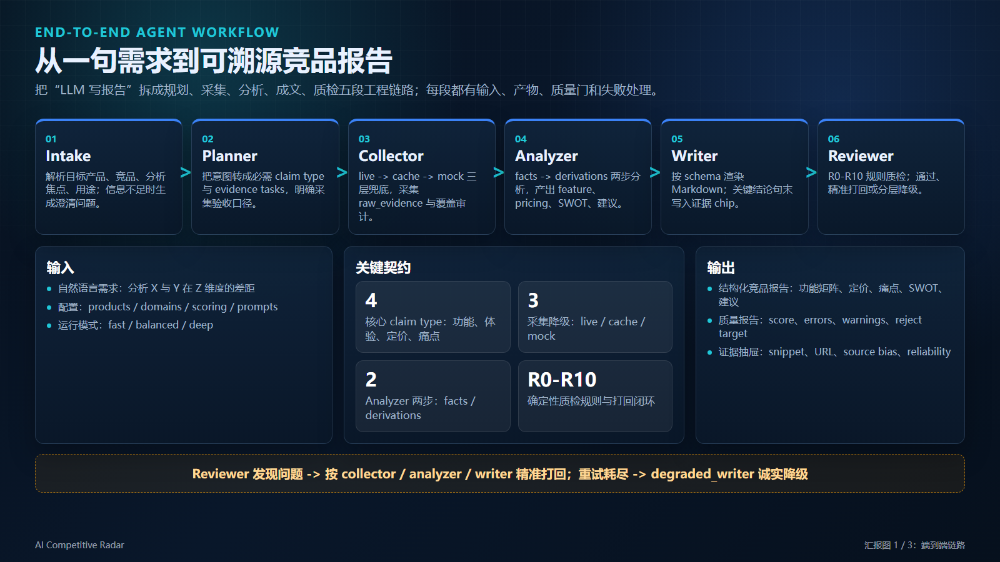
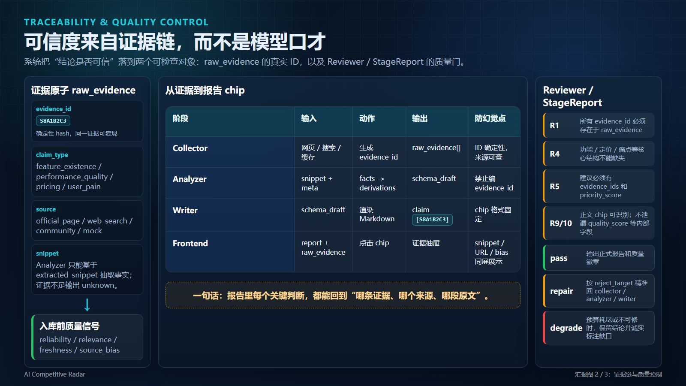
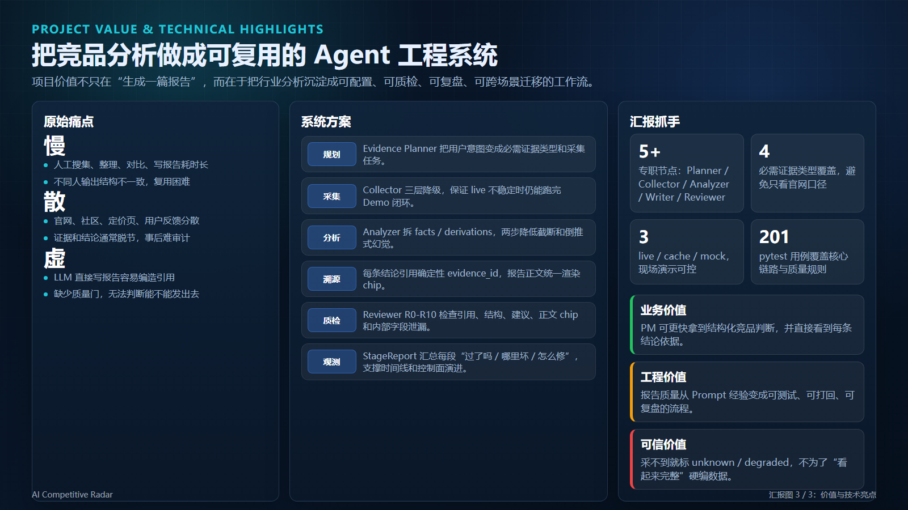
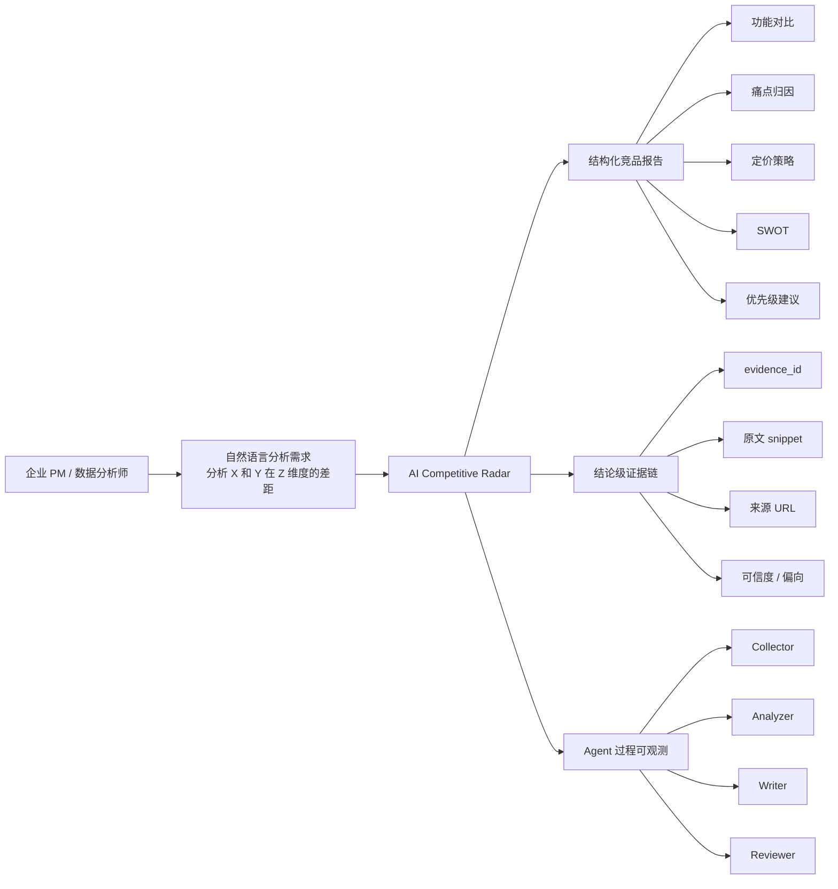
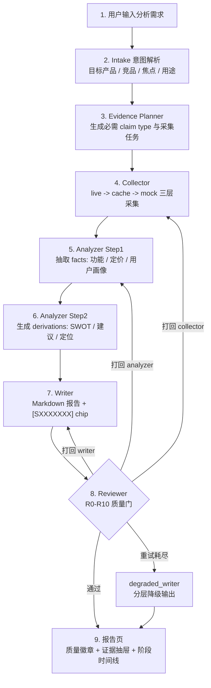
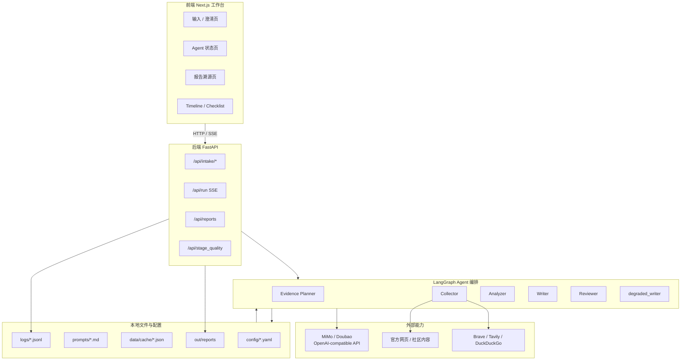
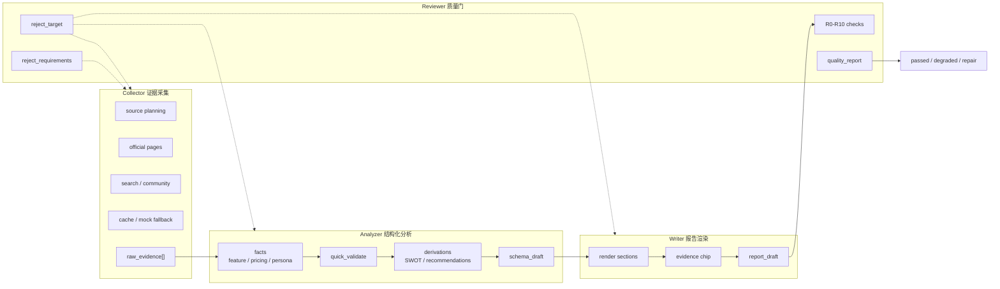
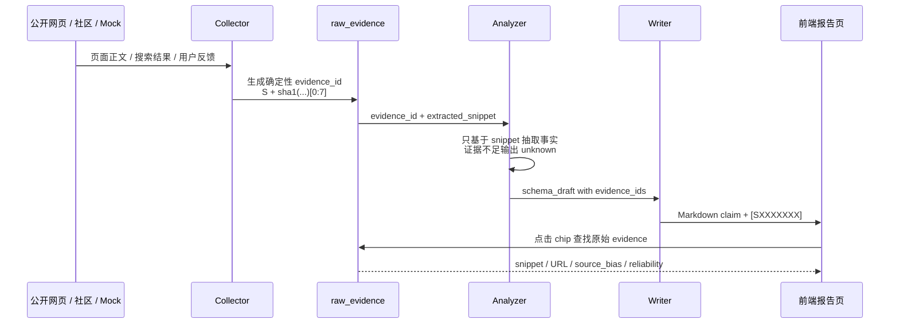
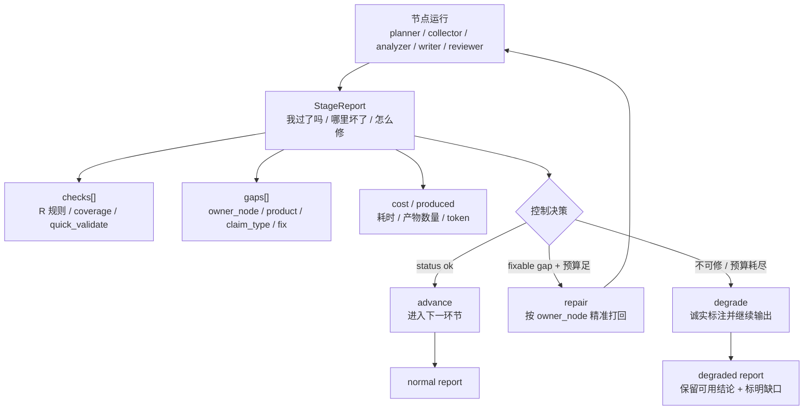
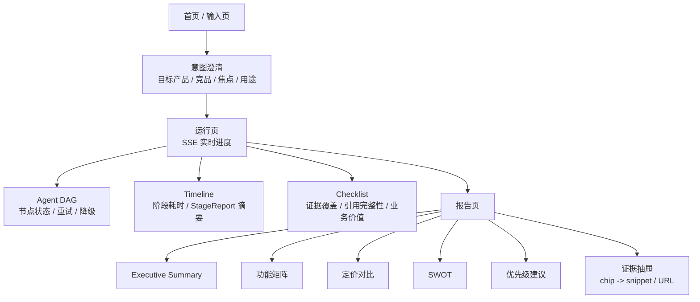

# AI Competitive Radar 项目介绍与图设计

> 用途：答辩、README、演示视频、路演页复用。本文不是代码契约，而是把项目讲清楚的“一页故事线 + 一组架构图”。
> 最新代码基线：v2.2.1 可用 Demo，v3 StageReport 控制平面已部分落地。

---

---

## 1. 一句话介绍

AI Competitive Radar 是一个面向 PM / 数据分析师的竞品分析 Agent 协作系统。用户输入一句自然语言需求，例如“分析 Cursor、Windsurf、GitHub Copilot 在代码补全体验上的差距”，系统会自动规划证据、采集公开资料、抽取结构化结论、生成 Markdown 报告，并让每一条关键结论都能点击回溯到原始证据。

项目要解决的不是“让 LLM 写一篇竞品文章”，而是把竞品分析拆成可验证的工程链路：证据从哪里来、结论依据是什么、质量门怎么判定、失败时如何打回或诚实降级。

---

## 2. 汇报图片资产

以下三张是可直接放进 PPT / 答辩材料的 16:9 信息图，使用 HTML/CSS 精确排版后导出，文字比 AI 直接生图更稳定。

| 图片 | 用途 | 文件 |
|------|------|------|
| 端到端链路 | 解释系统从输入到报告如何运行 | `docs/assets/report-01-pipeline.png` |
| 证据链与质量控制 | 解释为什么结论可信、如何防幻觉 | `docs/assets/report-02-trust-loop.png` |
| 价值与技术亮点 | 解释项目解决什么问题、有哪些工程抓手 | `docs/assets/report-03-value.png` |

> 可编辑源文件：`docs/report-infographics.html`。改文案后用 Playwright 截图即可重新导出 PNG。

---

## 3. 项目定位图

这张图适合放在开场页，用来解释项目服务对象、输入输出和核心差异。

讲解口径：

- 用户只需要提出分析目标，系统负责把模糊需求拆成证据计划与报告结构。
- 报告不是黑盒作文，每条关键 claim 都挂证据 chip。
- Agent 过程不是后台日志，前端能看到节点进度、打回原因和阶段质量。

---

## 4. 端到端流程图

这张图适合放在“系统如何工作”页，强调完整闭环。

设计重点：

- `Evidence Planner` 是 v2.2 之后新增的前置规划层，把“要采什么证据”显式化。
- `Analyzer` 保持两步式，事实层和推导层分开，减少 LLM 为结论倒编事实。
- `Reviewer` 不是只打分，而是能按目标节点打回，保证流程可收敛。

---

## 5. 系统架构图

这张图适合放在技术架构页，展示前端、后端、编排、外部服务和本地存储的关系。

讲解口径：

- 前端只负责交互与可视化，业务链路在后端 LangGraph 中执行。
- 配置、Prompt、缓存、报告、日志都落本地文件，便于 Demo 和复盘。
- SSE 让前端能实时展示 Agent 状态，而不是等整个报告生成后一次性返回。

---

## 6. Agent 协作流水线图

这张图适合解释四类 Agent 的职责边界，避免评委以为所有事都是一个 LLM 节点完成。

职责边界：

- Collector 只负责证据，不做语义结论。
- Analyzer 只基于 `extracted_snippet` 抽取事实和推导，不抓新数据，不编 evidence id。
- Writer 只渲染，不改 schema。
- Reviewer 只判定和路由，不自己修数据。

---

## 7. 证据链路设计图

这张图适合突出项目可信度：从原始网页到报告 chip 的引用闭环。

关键设计：

- `evidence_id` 用确定性 hash，不用 uuid，同一证据可复现。
- Analyzer 输出中的 `evidence_ids` 必须真实存在于 `raw_evidence`。
- Writer chip 格式固定为 `[SXXXXXXX]`，前端用同一模式识别和跳转。

---

## 8. 质量控制闭环图

这张图适合解释“失败可降级”和 v3 StageReport 控制平面的价值。

讲解口径：

- v2.2 已有 Reviewer 打回闭环；v3 的 StageReport 把每个环节的判定收敛成统一契约。
- 观测和控制都读同一个对象，不再靠事后解析 state 反推质量。
- 失败不是直接崩溃，而是在预算内精准修复，修不了就明确降级。

---

## 9. 前端信息架构图

这张图适合放在产品体验页，说明用户看到的不是命令行工具，而是完整工作台。

页面设计重点：

- 第一屏直接进入工作台，不做营销式落地页。
- 状态页把 Agent 运行过程显性化，减少“后台黑盒等待”。
- 报告页把质量徽章、业务价值、结构化正文和证据抽屉放在同一条阅读链路上。

---

## 10. 演示故事线

推荐按 5 分钟答辩节奏讲：

1. **痛点**：传统竞品分析慢、难复现、引用不可信；LLM 直接写报告容易幻觉。
2. **输入**：用户输入一句话分析需求，系统自动识别目标产品、竞品和分析焦点。
3. **协作**：Evidence Planner、Collector、Analyzer、Writer、Reviewer 分工完成，不是单节点作文。
4. **可信**：每条结论带 `[SXXXXXXX]` chip，可跳回原始 evidence。
5. **可控**：Reviewer 和 StageReport 发现问题后能精准打回，重试耗尽时诚实降级。
6. **可扩展**：换行业主要改 `config/*.yaml` 和 `prompts/*.md`，核心代码不变。

---

## 11. 视觉设计建议

图形风格建议：

- 主色用深蓝 / 青色表示系统主链路，橙色表示 Reviewer 打回，灰色表示 fallback / degraded。
- 节点命名保持动词 + 产物，例如 `Collect evidence`、`Extract facts`、`Render report`。
- 每张图只强调一个问题：定位图讲“给谁用”，流程图讲“怎么跑”，证据图讲“为什么可信”，控制图讲“失败怎么处理”。
- 答辩 PPT 中 Mermaid 可以转成图片，但节点文案不要再扩写，避免图上文字过密。

推荐颜色语义：

| 语义 | 颜色 | 用途 |
|------|------|------|
| 主流程 | `#2563eb` | 用户输入、Agent 主链路、正常输出 |
| 证据链 | `#0891b2` | evidence、chip、来源抽屉 |
| 质量门 | `#f59e0b` | Reviewer、checks、warnings |
| 失败 / 降级 | `#dc2626` | hard fail、degraded、retry exhausted |
| 配置 / 存储 | `#64748b` | YAML、cache、logs、reports |

---

## 12. 可复用短文案

**30 秒版**：

AI Competitive Radar 是一个可溯源的竞品分析 Agent 系统。它把“写竞品报告”拆成证据规划、采集、结构化分析、报告撰写和质量评审五个环节，用 LangGraph 串起来。系统最大的特点是每条结论都带确定性 evidence chip，可以点击回到原始 snippet 和 URL；同时 Reviewer 会做质量门检查，发现引用断链、证据不足或结构问题时精准打回，修不了就诚实降级。

**10 秒版**：

这是一个把竞品分析从“LLM 作文”变成“可验证证据链 + Agent 质量闭环”的系统。
