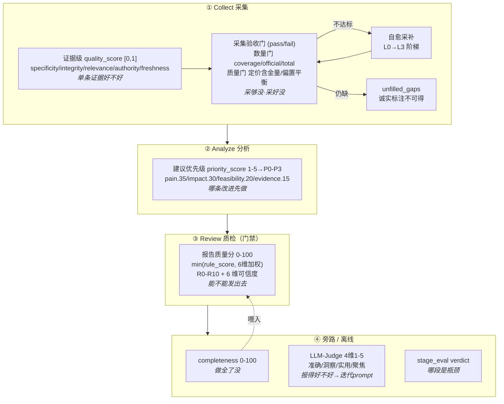

# 评分体系架构图（答辩用）

> 一句话：**五层评分各管一件事、互补不重复**——单条证据好不好 → 采够采好没 → 哪条建议先做 → 报告能不能发 → 报得好不好。
> 所有权重/阈值集中在 [`config/scoring.yaml`](../config/scoring.yaml)，跨行业可调。

---

## 一、全景图（随管线流动）



ASCII 备份（无 Mermaid 渲染时）：

```
Collect ─┬─ 证据级 quality_score(0-1) ── 单条证据好不好
         └─ 采集验收门(pass/fail) ───── 采够没/采好没 ──不达标→自愈采补→仍缺→诚实标注
   ↓
Analyze ── 建议优先级 priority_score(1-5→P0-P3) ── 哪条建议先做
   ↓
Review ─── 报告质量分 = min(rule_score, 6维加权)(0-100) ── 能不能发(自洽+可信度)
   ↓
旁路/离线 ─┬─ completeness(0-100) 做全没  →喂入 Review 的「报告完整度」维
           ├─ LLM-Judge(4维) 报得好不好 → 改 prompt(离线)
           └─ stage_eval(verdict) 哪段瓶颈
```

---

## 二、为什么需要每一层 + 不重复的边界

| 层 | 回答的问题 | 时机 | 性质 | **不做什么**（边界） |
|---|---|---|---|---|
| 证据级 `quality_score` | 这**一条**证据可信吗 | 采集中 | 确定性 0-1 | 不看整体覆盖、不下结论 |
| 采集验收门 | 整体**采够/采好**了吗 | 采集出口 | pass/fail | 不评单条、不评分析质量 |
| 建议优先级 `priority_score` | 哪条**改进先做** | 分析 | 加权 1-5 | 不评证据、不管报告对错 |
| 报告质量分 | 报告**能不能发** | 质检门禁 | 确定性 0-100 | 不评"好不好"(那是主观) |
| LLM-Judge | 报得**好不好** | 离线 | 主观 4×1-5 | 不打回(只迭代 prompt) |

**关键去重设计**（回应"你这么多分会不会重复算"）：
1. **报告完整度** 维度直接调 `completeness_metrics` —— 单一计算来源，不各算一份。
2. **可追溯性 / 证据覆盖** 共用同一个 schema 引用覆盖率函数。
3. **单条证据质量统一 `quality_score`** —— 旧 `evidence_confidence` 已退役为决策信号（仅缺分时末位兜底）。
4. **确定性 vs 主观分离** —— 能用代码判的(R0-R10/采集门/completeness)绝不交给 LLM；只有"好不好"这种主观判断才用 LLM-Judge，且离线不打回。

---

## 三、诚实降级闭环（区别于"硬凑数"的核心卖点）

```
采集门不达标 → 自愈采补(换策略 L0→L3) → 仍拿不到 → unfilled_gaps
                                                      ↓
报告「数据可得性说明」显式标注：可灵Kling 定价 = 不可得(积分制,无月费数据)
```
**不编一个假价格填进去** —— 对齐核心原则#4「抑制幻觉」。这是"可信的竞品情报"与"看起来很全的报告"的分水岭。

---

## 四、评委可能问 & 答

- **Q：这么多评分，到底信哪个？**
  A：分场景。**门禁信报告质量分**(能不能发)，**排序信优先级分**(先做哪条)，**迭代信 Judge**(怎么改进)，**采集信验收门+证据质量分**。各管一段，不冲突。
- **Q：会不会重复打分、自我循环？**
  A：不会。完整度只算一次(被质检复用)，覆盖率共用一个函数，确定性与主观严格分离。见上「去重设计」。
- **Q：换个行业还能用吗？**
  A：能。所有权重/阈值在 `config/scoring.yaml`，改 yaml 零改码；源台账 `source_ledger` 还会自学高质量源复用。
- **Q：数据采不到怎么办？**
  A：先自愈采补(换策略阶梯)，仍拿不到就**诚实标注不可得**，绝不编。报告里有专门的「数据可得性说明」。

---

> 需要把本图导成**飞书画板**演示，可用 lark-whiteboard skill 把上面的 Mermaid 直接渲染成可编辑画板。
